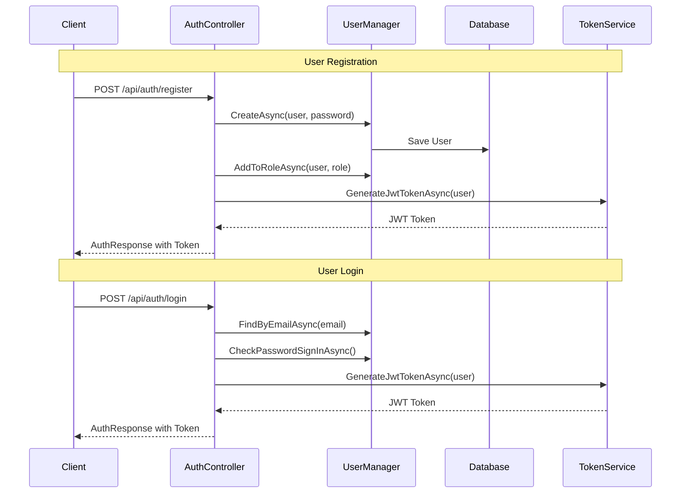
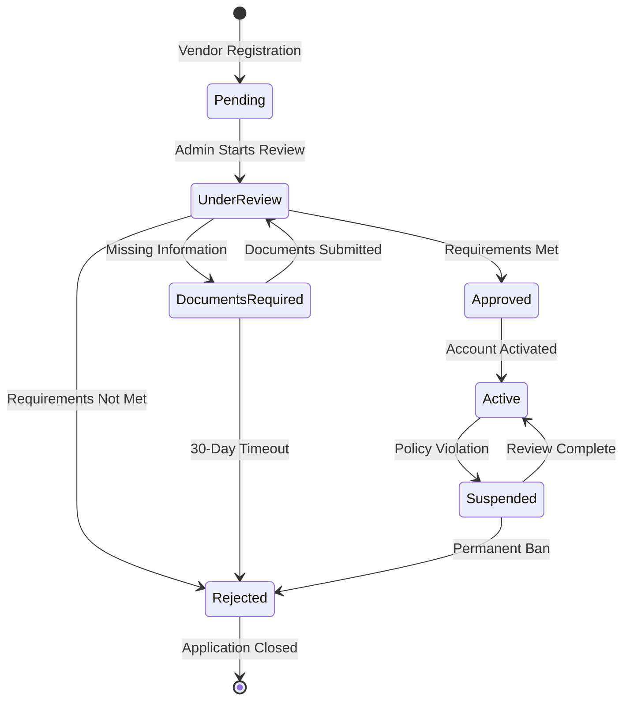
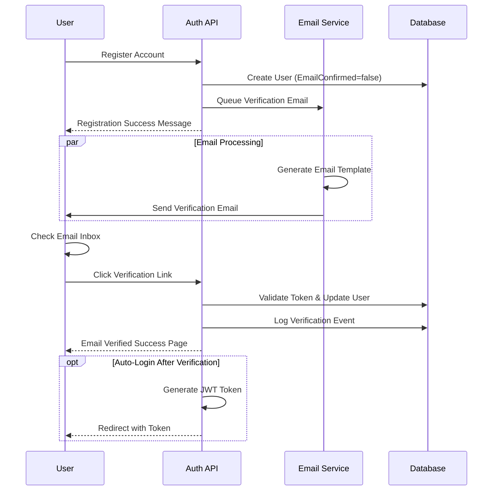
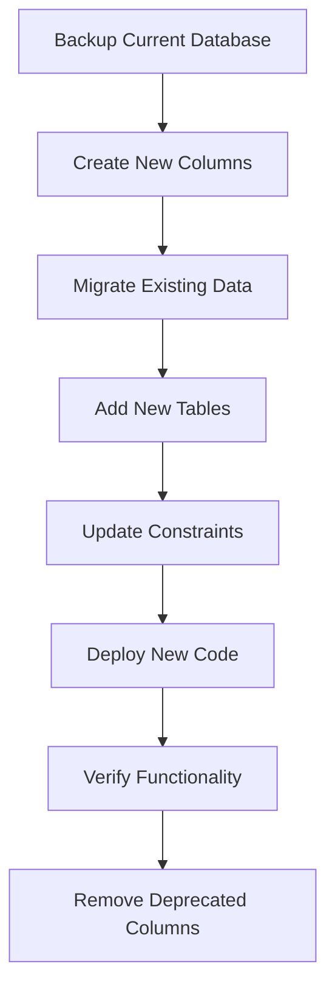

# Identity System Refactoring Design
## Kasuwa Online Marketplace Platform

**Version:** 1.0  
**Date:** December 2024  
**Project:** Identity System Core Implementation Refactoring

---

## 1. Overview

This design document outlines the refactoring of the existing identity system in the Kasuwa marketplace to ensure all core functionality is properly implemented and aligned with the PRD requirements for a production-ready marketplace platform.

### 1.1 Current State Analysis

The existing implementation provides:
- ASP.NET Core Identity with JWT authentication
- Three user types: Customer, Vendor, Administrator
- Basic registration and login functionality
- Vendor approval workflow
- Admin user management with pagination and filtering
- Role-based authorization policies
- Basic password policies and account lockout

### 1.2 Refactoring Objectives

- Fix missing database seeding for default roles
- Implement proper password reset functionality
- Enhance user profile management
- Improve vendor approval workflow
- Add proper refresh token management
- Implement comprehensive input validation
- Fix authorization policy configuration
- Add proper error handling and logging
- Ensure all PRD authentication requirements are met

---

## 2. Technology Stack & Architecture

### 2.1 Current Technology Stack
- ASP.NET Core 9.0 with Identity Framework
- Entity Framework Core with SQL Server
- JWT Bearer Authentication
- Custom ApplicationUser extending IdentityUser
- Role-based authorization

### 2.2 Architecture Components

```mermaid
classDiagram
    class ApplicationUser {
        +string Id
        +string Email
        +string FirstName
        +string LastName
        +UserType UserType
        +bool IsActive
        +bool IsVendorApproved
        +DateTime DateCreated
        +DateTime? LastLogin
        +List~UserAddress~ Addresses
    }

    class UserAddress {
        +int Id
        +string UserId
        +string AddressLine1
        +string City
        +string State
        +string PostalCode
        +bool IsDefault
    }

    class AuthController {
        +RegisterAsync()
        +LoginAsync()
        +RefreshTokenAsync()
        +LogoutAsync()
        +ChangePasswordAsync()
    }

    class AdminController {
        +GetUsersAsync()
        +ApproveVendorAsync()
        +ToggleUserStatusAsync()
        +AssignRoleAsync()
    }

    ApplicationUser ||--o{ UserAddress
    AuthController --> ApplicationUser
    AdminController --> ApplicationUser
```

---

## 3. Core Identity Features Implementation

### 3.1 User Registration & Authentication Flow



### 3.2 Role-Based Authorization

| Role | Permissions | Description |
|------|-------------|-------------|
| **Customer** | Product browsing, Shopping cart, Order placement | Regular marketplace users |
| **Vendor** | Product management, Order fulfillment, Sales analytics | Approved sellers |
| **Administrator** | User management, Platform configuration, System monitoring | Platform managers |

### 3.3 User Types Implementation

```csharp
public enum UserType
{
    Customer = 1,      // Regular customers
    Vendor = 2,        // Product sellers  
    Administrator = 3  // Platform admins
}
```

---

## 4. Critical Implementation Gaps

### 4.1 Missing Database Role Seeding

**Problem:** Default roles are not automatically created in the database.

**Solution:** Implement database seeding in Program.cs

```csharp
public static async Task SeedDatabaseAsync(IServiceProvider services)
{
    using var scope = services.CreateScope();
    var roleManager = scope.ServiceProvider.GetRequiredService<RoleManager<IdentityRole>>();
    var userManager = scope.ServiceProvider.GetRequiredService<UserManager<ApplicationUser>>();

    // Create default roles
    string[] roles = { "Customer", "Vendor", "Administrator" };
    
    foreach (var role in roles)
    {
        if (!await roleManager.RoleExistsAsync(role))
        {
            await roleManager.CreateAsync(new IdentityRole(role));
        }
    }

    // Create default admin user if not exists
    var adminEmail = "admin@kasuwa.com";
    var adminUser = await userManager.FindByEmailAsync(adminEmail);
    
    if (adminUser == null)
    {
        adminUser = new ApplicationUser
        {
            UserName = adminEmail,
            Email = adminEmail,
            FirstName = "System",
            LastName = "Administrator",
            UserType = UserType.Administrator,
            IsActive = true
        };
        
        await userManager.CreateAsync(adminUser, "Admin123!");
        await userManager.AddToRoleAsync(adminUser, "Administrator");
    }
}
```

### 4.2 Missing Password Reset Functionality

**Problem:** Password reset endpoints are not implemented.

**Solution:** Add forgot password and reset password endpoints

```csharp
[HttpPost("forgot-password")]
public async Task<ActionResult<AuthResponseDto>> ForgotPassword([FromBody] ForgotPasswordRequestDto request)
{
    var user = await _userManager.FindByEmailAsync(request.Email);
    if (user == null || !user.IsActive)
    {
        // Don't reveal that the user does not exist
        return Ok(new AuthResponseDto { Success = true, Message = "Password reset link sent if email exists" });
    }

    var token = await _userManager.GeneratePasswordResetTokenAsync(user);
    
    // In production, send email with reset link
    // For now, return token for testing
    _logger.LogInformation("Password reset token for {Email}: {Token}", request.Email, token);
    
    return Ok(new AuthResponseDto
    {
        Success = true,
        Message = "Password reset link sent to your email"
    });
}

[HttpPost("reset-password")]
public async Task<ActionResult<AuthResponseDto>> ResetPassword([FromBody] ResetPasswordRequestDto request)
{
    var user = await _userManager.FindByEmailAsync(request.Email);
    if (user == null)
    {
        return BadRequest(new AuthResponseDto { Success = false, Message = "Invalid request" });
    }

    var result = await _userManager.ResetPasswordAsync(user, request.Token, request.Password);
    if (!result.Succeeded)
    {
        return BadRequest(new AuthResponseDto
        {
            Success = false,
            Message = string.Join(", ", result.Errors.Select(e => e.Description))
        });
    }

    return Ok(new AuthResponseDto
    {
        Success = true,
        Message = "Password reset successfully"
    });
}
```

### 4.3 Missing Refresh Token Storage

**Problem:** Refresh tokens are generated but not stored or validated properly.

**Solution:** Add RefreshToken entity and proper validation

```csharp
public class RefreshToken
{
    public int Id { get; set; }
    public string UserId { get; set; } = string.Empty;
    public string Token { get; set; } = string.Empty;
    public DateTime ExpiryDate { get; set; }
    public bool IsRevoked { get; set; }
    public DateTime CreatedDate { get; set; } = DateTime.UtcNow;
    
    public virtual ApplicationUser User { get; set; } = null!;
}
```

### 4.4 Missing User Profile Management

**Problem:** No dedicated endpoints for user profile updates.

**Solution:** Add ProfileController with CRUD operations

```csharp
[HttpGet]
[Authorize]
public async Task<ActionResult<UserProfileDto>> GetProfile()
{
    var userId = User.FindFirst(ClaimTypes.NameIdentifier)?.Value;
    var user = await _userManager.FindByIdAsync(userId!);
    
    if (user == null) return NotFound();
    
    return Ok(new UserProfileDto
    {
        Id = user.Id,
        Email = user.Email!,
        FirstName = user.FirstName,
        LastName = user.LastName,
        ProfileImageUrl = user.ProfileImageUrl,
        BusinessName = user.BusinessName,
        BusinessDescription = user.BusinessDescription
    });
}

[HttpPut]
[Authorize]
public async Task<ActionResult<AuthResponseDto>> UpdateProfile([FromBody] UpdateProfileDto request)
{
    var userId = User.FindFirst(ClaimTypes.NameIdentifier)?.Value;
    var user = await _userManager.FindByIdAsync(userId!);
    
    if (user == null) return NotFound();
    
    user.FirstName = request.FirstName;
    user.LastName = request.LastName;
    user.BusinessName = request.BusinessName;
    user.BusinessDescription = request.BusinessDescription;
    
    var result = await _userManager.UpdateAsync(user);
    if (!result.Succeeded)
    {
        return BadRequest(new AuthResponseDto
        {
            Success = false,
            Message = string.Join(", ", result.Errors.Select(e => e.Description))
        });
    }
    
    return Ok(new AuthResponseDto { Success = true, Message = "Profile updated successfully" });
}
```

### 4.5 Missing Input Validation

**Problem:** DTOs lack comprehensive validation attributes.

**Solution:** Enhance validation attributes

```csharp
public class RegisterRequestDto
{
    [Required(ErrorMessage = "Email is required")]
    [EmailAddress(ErrorMessage = "Invalid email format")]
    [StringLength(100, ErrorMessage = "Email cannot exceed 100 characters")]
    public string Email { get; set; } = string.Empty;
    
    [Required(ErrorMessage = "Password is required")]
    [StringLength(100, MinimumLength = 8, ErrorMessage = "Password must be between 8 and 100 characters")]
    [RegularExpression(@"^(?=.*[a-z])(?=.*[A-Z])(?=.*\d)[a-zA-Z\d@$!%*?&]{8,}$", 
        ErrorMessage = "Password must contain at least one uppercase letter, one lowercase letter, and one number")]
    public string Password { get; set; } = string.Empty;
    
    [Required(ErrorMessage = "Confirm password is required")]
    [Compare("Password", ErrorMessage = "Passwords do not match")]
    public string ConfirmPassword { get; set; } = string.Empty;
    
    [Required(ErrorMessage = "First name is required")]
    [StringLength(50, MinimumLength = 2, ErrorMessage = "First name must be between 2 and 50 characters")]
    [RegularExpression(@"^[a-zA-Z\s]+$", ErrorMessage = "First name can only contain letters and spaces")]
    public string FirstName { get; set; } = string.Empty;
    
    [Required(ErrorMessage = "Last name is required")]
    [StringLength(50, MinimumLength = 2, ErrorMessage = "Last name must be between 2 and 50 characters")]
    [RegularExpression(@"^[a-zA-Z\s]+$", ErrorMessage = "Last name can only contain letters and spaces")]
    public string LastName { get; set; } = string.Empty;
    
    [Required(ErrorMessage = "User type is required")]
    [EnumDataType(typeof(UserType), ErrorMessage = "Invalid user type")]
    public UserType UserType { get; set; }
    
    // Vendor-specific validation
    [RequiredIf("UserType", UserType.Vendor, ErrorMessage = "Business name is required for vendors")]
    [StringLength(100, ErrorMessage = "Business name cannot exceed 100 characters")]
    public string? BusinessName { get; set; }
    
    [StringLength(500, ErrorMessage = "Business description cannot exceed 500 characters")]
    public string? BusinessDescription { get; set; }
}
```

---

## 5. Enhanced API Endpoints

### 5.1 Complete Authentication API

| Method | Endpoint | Description | Auth Required |
|--------|----------|-------------|---------------|
| POST | `/api/auth/register` | User registration | No |
| POST | `/api/auth/login` | User login | No |
| POST | `/api/auth/refresh` | Refresh JWT token | No |
| POST | `/api/auth/logout` | User logout | Yes |
| POST | `/api/auth/logout-all` | Logout from all devices | Yes |
| GET | `/api/auth/profile` | Get user profile | Yes |
| POST | `/api/auth/change-password` | Change password | Yes |
| POST | `/api/auth/forgot-password` | Request password reset | No |
| POST | `/api/auth/reset-password` | Reset password with token | No |

### 5.2 User Profile Management API

| Method | Endpoint | Description | Auth Required |
|--------|----------|-------------|---------------|
| GET | `/api/profile` | Get current user profile | Yes |
| PUT | `/api/profile` | Update user profile | Yes |
| POST | `/api/profile/avatar` | Upload profile image | Yes |
| GET | `/api/profile/addresses` | Get user addresses | Yes |
| POST | `/api/profile/addresses` | Add new address | Yes |
| PUT | `/api/profile/addresses/{id}` | Update address | Yes |
| DELETE | `/api/profile/addresses/{id}` | Delete address | Yes |
| PUT | `/api/profile/addresses/{id}/default` | Set default address | Yes |

### 5.3 Vendor Management API

| Method | Endpoint | Description | Auth Required |
|--------|----------|-------------|---------------|
| GET | `/api/vendor/application-status` | Get vendor application status | Vendor |
| PUT | `/api/vendor/business-profile` | Update business information | Vendor |
| GET | `/api/vendor/dashboard-stats` | Get vendor dashboard statistics | Vendor |

### 5.4 Enhanced Admin API

| Method | Endpoint | Description | Auth Required |
|--------|----------|-------------|---------------|
| GET | `/api/admin/users` | Get all users (with filters) | Admin |
| GET | `/api/admin/users/{id}` | Get user details | Admin |
| POST | `/api/admin/users/{id}/approve-vendor` | Approve/reject vendor | Admin |
| POST | `/api/admin/users/{id}/toggle-status` | Activate/deactivate user | Admin |
| POST | `/api/admin/users/{id}/roles` | Assign role to user | Admin |
| DELETE | `/api/admin/users/{id}/roles/{role}` | Remove role from user | Admin |
| GET | `/api/admin/roles` | Get all available roles | Admin |
| GET | `/api/admin/dashboard-stats` | Get admin dashboard statistics | Admin |
| GET | `/api/admin/vendor-applications` | Get pending vendor applications | Admin |

---

## 6. Enhanced DTOs Architecture

### 6.1 Missing DTOs

```csharp
// Profile Management DTOs
public class UserProfileDto
{
    public string Id { get; set; } = string.Empty;
    public string Email { get; set; } = string.Empty;
    public string FirstName { get; set; } = string.Empty;
    public string LastName { get; set; } = string.Empty;
    public UserType UserType { get; set; }
    public string? ProfileImageUrl { get; set; }
    public string? BusinessName { get; set; }
    public string? BusinessDescription { get; set; }
    public DateTime DateCreated { get; set; }
    public DateTime? LastLogin { get; set; }
    public List<UserAddressDto> Addresses { get; set; } = new();
}

public class UpdateProfileDto
{
    [Required, StringLength(50)]
    public string FirstName { get; set; } = string.Empty;
    
    [Required, StringLength(50)]
    public string LastName { get; set; } = string.Empty;
    
    [StringLength(100)]
    public string? BusinessName { get; set; }
    
    [StringLength(500)]
    public string? BusinessDescription { get; set; }
}

public class UserAddressDto
{
    public int Id { get; set; }
    public string AddressLine1 { get; set; } = string.Empty;
    public string? AddressLine2 { get; set; }
    public string City { get; set; } = string.Empty;
    public string State { get; set; } = string.Empty;
    public string PostalCode { get; set; } = string.Empty;
    public string Country { get; set; } = string.Empty;
    public bool IsDefault { get; set; }
}

public class AddUserAddressDto
{
    [Required, StringLength(100)]
    public string AddressLine1 { get; set; } = string.Empty;
    
    [StringLength(100)]
    public string? AddressLine2 { get; set; }
    
    [Required, StringLength(50)]
    public string City { get; set; } = string.Empty;
    
    [Required, StringLength(50)]
    public string State { get; set; } = string.Empty;
    
    [Required, StringLength(10)]
    public string PostalCode { get; set; } = string.Empty;
    
    [Required, StringLength(50)]
    public string Country { get; set; } = string.Empty;
    
    public bool IsDefault { get; set; } = false;
}

// Admin Dashboard DTOs
public class AdminDashboardStatsDto
{
    public int TotalUsers { get; set; }
    public int TotalCustomers { get; set; }
    public int TotalVendors { get; set; }
    public int PendingVendorApplications { get; set; }
    public int ActiveVendors { get; set; }
    public int InactiveUsers { get; set; }
    public List<UserRegistrationStatsDto> RecentRegistrations { get; set; } = new();
}

public class UserRegistrationStatsDto
{
    public DateTime Date { get; set; }
    public int CustomerCount { get; set; }
    public int VendorCount { get; set; }
}

public class VendorApplicationDto
{
    public string UserId { get; set; } = string.Empty;
    public string Email { get; set; } = string.Empty;
    public string FullName { get; set; } = string.Empty;
    public string BusinessName { get; set; } = string.Empty;
    public string BusinessDescription { get; set; } = string.Empty;
    public DateTime ApplicationDate { get; set; }
    public bool IsApproved { get; set; }
}
```

### 6.2 Enhanced Error Response DTOs

```csharp
public class ApiErrorResponse
{
    public bool Success { get; set; } = false;
    public string Message { get; set; } = string.Empty;
    public List<string> Errors { get; set; } = new();
    public string? TraceId { get; set; }
    public DateTime Timestamp { get; set; } = DateTime.UtcNow;
}

public class ValidationErrorResponse : ApiErrorResponse
{
    public Dictionary<string, List<string>> ValidationErrors { get; set; } = new();
}
```

---

## 7. Database Schema Enhancements

### 7.1 Missing Database Configurations

**Problem:** ApplicationDbContext lacks proper entity configurations.

**Solution:** Add comprehensive entity configurations

```csharp
protected override void OnModelCreating(ModelBuilder builder)
{
    base.OnModelCreating(builder);
    
    // ApplicationUser configuration
    builder.Entity<ApplicationUser>(entity =>
    {
        entity.Property(e => e.FirstName).HasMaxLength(50).IsRequired();
        entity.Property(e => e.LastName).HasMaxLength(50).IsRequired();
        entity.Property(e => e.BusinessName).HasMaxLength(100);
        entity.Property(e => e.BusinessDescription).HasMaxLength(500);
        entity.Property(e => e.BusinessAddress).HasMaxLength(200);
        entity.Property(e => e.BusinessPhone).HasMaxLength(20);
        entity.Property(e => e.PreferredLanguage).HasMaxLength(10);
        entity.Property(e => e.ProfileImageUrl).HasMaxLength(500);
        
        // Indexes for performance
        entity.HasIndex(e => e.Email).IsUnique();
        entity.HasIndex(e => e.UserType);
        entity.HasIndex(e => e.IsActive);
        entity.HasIndex(e => e.IsVendorApproved);
        entity.HasIndex(e => new { e.UserType, e.IsVendorApproved });
    });
    
    // UserAddress configuration
    builder.Entity<UserAddress>(entity =>
    {
        entity.HasKey(e => e.Id);
        entity.Property(e => e.AddressLine1).HasMaxLength(100).IsRequired();
        entity.Property(e => e.AddressLine2).HasMaxLength(100);
        entity.Property(e => e.City).HasMaxLength(50).IsRequired();
        entity.Property(e => e.State).HasMaxLength(50).IsRequired();
        entity.Property(e => e.PostalCode).HasMaxLength(10).IsRequired();
        entity.Property(e => e.Country).HasMaxLength(50).IsRequired();
        
        entity.HasOne(e => e.User)
              .WithMany(u => u.Addresses)
              .HasForeignKey(e => e.UserId)
              .OnDelete(DeleteBehavior.Cascade);
              
        entity.HasIndex(e => e.UserId);
        entity.HasIndex(e => e.IsDefault);
    });
    
    // RefreshToken configuration (if implemented)
    builder.Entity<RefreshToken>(entity =>
    {
        entity.HasKey(e => e.Id);
        entity.Property(e => e.Token).HasMaxLength(500).IsRequired();
        entity.Property(e => e.UserId).IsRequired();
        
        entity.HasOne(e => e.User)
              .WithMany()
              .HasForeignKey(e => e.UserId)
              .OnDelete(DeleteBehavior.Cascade);
              
        entity.HasIndex(e => e.Token).IsUnique();
        entity.HasIndex(e => e.UserId);
        entity.HasIndex(e => e.ExpiryDate);
    });
}
```

### 7.2 Required Database Migration

```sql
-- Add missing indexes for performance
CREATE INDEX IX_AspNetUsers_UserType ON AspNetUsers (UserType);
CREATE INDEX IX_AspNetUsers_IsActive ON AspNetUsers (IsActive);
CREATE INDEX IX_AspNetUsers_IsVendorApproved ON AspNetUsers (IsVendorApproved);
CREATE INDEX IX_AspNetUsers_UserType_IsVendorApproved ON AspNetUsers (UserType, IsVendorApproved);
CREATE INDEX IX_UserAddresses_UserId ON UserAddresses (UserId);
CREATE INDEX IX_UserAddresses_IsDefault ON UserAddresses (IsDefault);
```

---

## 8. Security Improvements

### 8.1 Enhanced JWT Configuration

**Problem:** JWT configuration lacks production security settings.

**Solution:** Strengthen JWT security in Program.cs

```csharp
// Enhanced JWT configuration
builder.Services.AddAuthentication(options =>
{
    options.DefaultAuthenticateScheme = JwtBearerDefaults.AuthenticationScheme;
    options.DefaultChallengeScheme = JwtBearerDefaults.AuthenticationScheme;
    options.DefaultScheme = JwtBearerDefaults.AuthenticationScheme;
})
.AddJwtBearer(options =>
{
    options.SaveToken = true;
    options.RequireHttpsMetadata = !builder.Environment.IsDevelopment();
    options.TokenValidationParameters = new TokenValidationParameters()
    {
        ValidateIssuer = true,
        ValidateAudience = true,
        ValidateLifetime = true,
        ValidateIssuerSigningKey = true,
        ClockSkew = TimeSpan.Zero, // No tolerance for token expiration
        ValidAudience = jwtSettings["ValidAudience"],
        ValidIssuer = jwtSettings["ValidIssuer"],
        IssuerSigningKey = new SymmetricSecurityKey(key),
        
        // Additional security settings
        RequireExpirationTime = true,
        RequireSignedTokens = true
    };
    
    // Enhanced token validation events
    options.Events = new JwtBearerEvents
    {
        OnTokenValidated = context =>
        {
            // Additional custom validation logic
            var userManager = context.HttpContext.RequestServices
                .GetRequiredService<UserManager<ApplicationUser>>();
            
            var userId = context.Principal?.FindFirst(ClaimTypes.NameIdentifier)?.Value;
            if (!string.IsNullOrEmpty(userId))
            {
                var user = userManager.FindByIdAsync(userId).Result;
                if (user == null || !user.IsActive)
                {
                    context.Fail("User is not active");
                }
            }
            
            return Task.CompletedTask;
        },
        OnAuthenticationFailed = context =>
        {
            // Log authentication failures
            var logger = context.HttpContext.RequestServices
                .GetRequiredService<ILogger<Program>>();
            logger.LogWarning("JWT Authentication failed: {Exception}", context.Exception.Message);
            
            return Task.CompletedTask;
        }
    };
});
```

### 8.2 Enhanced Password Policies

```csharp
// Enhanced Identity configuration
builder.Services.AddIdentity<ApplicationUser, IdentityRole>(options =>
{
    // Stronger password requirements
    options.Password.RequireDigit = true;
    options.Password.RequireLowercase = true;
    options.Password.RequireUppercase = true;
    options.Password.RequireNonAlphanumeric = true;
    options.Password.RequiredLength = 12; // Increased from 8
    options.Password.RequiredUniqueChars = 4;

    // Enhanced lockout settings
    options.Lockout.DefaultLockoutTimeSpan = TimeSpan.FromMinutes(15); // Increased
    options.Lockout.MaxFailedAccessAttempts = 3; // Decreased
    options.Lockout.AllowedForNewUsers = true;

    // Strict user settings
    options.User.RequireUniqueEmail = true;
    options.User.AllowedUserNameCharacters = "abcdefghijklmnopqrstuvwxyzABCDEFGHIJKLMNOPQRSTUVWXYZ0123456789-._@+";

    // Sign in requirements
    options.SignIn.RequireConfirmedEmail = false;
    options.SignIn.RequireConfirmedPhoneNumber = false;
})
.AddEntityFrameworkStores<ApplicationDbContext>()
.AddDefaultTokenProviders();
```

### 8.3 Authorization Policy Enhancements

```csharp
// Enhanced authorization policies
builder.Services.AddAuthorization(options =>
{
    // Basic role policies
    options.AddPolicy("RequireCustomerRole", policy => 
        policy.RequireRole("Customer"));
    
    options.AddPolicy("RequireVendorRole", policy => 
        policy.RequireRole("Vendor")
              .RequireClaim("userType", UserType.Vendor.ToString()));
    
    options.AddPolicy("RequireAdminRole", policy => 
        policy.RequireRole("Administrator")
              .RequireClaim("userType", UserType.Administrator.ToString()));
    
    options.AddPolicy("RequireVendorOrAdmin", policy => 
        policy.RequireRole("Vendor", "Administrator"));
    
    // Advanced policies
    options.AddPolicy("RequireApprovedVendor", policy =>
        policy.RequireRole("Vendor")
              .RequireAssertion(context =>
              {
                  var userManager = context.Resource as UserManager<ApplicationUser>;
                  var userId = context.User.FindFirst(ClaimTypes.NameIdentifier)?.Value;
                  if (string.IsNullOrEmpty(userId)) return false;
                  
                  var user = userManager?.FindByIdAsync(userId).Result;
                  return user?.IsVendorApproved == true;
              }));
    
    options.AddPolicy("RequireActiveUser", policy =>
        policy.RequireAssertion(context =>
        {
            var userManager = context.Resource as UserManager<ApplicationUser>;
            var userId = context.User.FindFirst(ClaimTypes.NameIdentifier)?.Value;
            if (string.IsNullOrEmpty(userId)) return false;
            
            var user = userManager?.FindByIdAsync(userId).Result;
            return user?.IsActive == true;
        }));
});
```

---

## 9. Error Handling & Logging

### 9.1 Global Exception Handling

**Problem:** No centralized error handling middleware.

**Solution:** Implement global exception middleware

```csharp
public class GlobalExceptionMiddleware
{
    private readonly RequestDelegate _next;
    private readonly ILogger<GlobalExceptionMiddleware> _logger;

    public GlobalExceptionMiddleware(RequestDelegate next, ILogger<GlobalExceptionMiddleware> logger)
    {
        _next = next;
        _logger = logger;
    }

    public async Task InvokeAsync(HttpContext context)
    {
        try
        {
            await _next(context);
        }
        catch (Exception ex)
        {
            _logger.LogError(ex, "An unhandled exception occurred");
            await HandleExceptionAsync(context, ex);
        }
    }

    private static async Task HandleExceptionAsync(HttpContext context, Exception exception)
    {
        context.Response.ContentType = "application/json";
        var response = new ApiErrorResponse { TraceId = context.TraceIdentifier };

        switch (exception)
        {
            case UnauthorizedAccessException:
                context.Response.StatusCode = 401;
                response.Message = "Unauthorized access";
                break;
            case ArgumentException argEx:
                context.Response.StatusCode = 400;
                response.Message = argEx.Message;
                break;
            default:
                context.Response.StatusCode = 500;
                response.Message = "An internal server error occurred";
                break;
        }

        await context.Response.WriteAsync(JsonSerializer.Serialize(response));
    }
}
```

---

## 10. Implementation Priority

### Phase 1: Core Fixes (Week 1)
1. Add database role seeding to Program.cs
2. Implement password reset endpoints
3. Add comprehensive input validation
4. Fix JWT configuration for production

### Phase 2: User Management (Week 2)
1. Create ProfileController
2. Implement address management
3. Add admin dashboard enhancements
4. Improve vendor approval workflow

### Phase 3: Security & Testing (Week 3)
1. Add global exception handling
2. Implement comprehensive testing
3. Security audit and performance optimization
4. Documentation updates

---

## 11. Validation Checklist

- [ ] All PRD authentication requirements implemented
- [ ] Database seeding works correctly
- [ ] Password reset flow functional
- [ ] User profile management complete
- [ ] Admin dashboard operational
- [ ] Vendor approval workflow tested
- [ ] Security configurations validated
- [ ] API endpoints documented
- [ ] Unit and integration tests pass
- [ ] Performance benchmarks met
{
    private readonly RequestDelegate _next;
    private readonly ILogger<GlobalExceptionMiddleware> _logger;

    public GlobalExceptionMiddleware(RequestDelegate next, ILogger<GlobalExceptionMiddleware> logger)
    {
        _next = next;
        _logger = logger;
    }

    public async Task InvokeAsync(HttpContext context)
    {
        try
        {
            await _next(context);
        }
        catch (Exception ex)
        {
            _logger.LogError(ex, "An unhandled exception occurred");
            await HandleExceptionAsync(context, ex);
        }
    }

    private static async Task HandleExceptionAsync(HttpContext context, Exception exception)
    {
        context.Response.ContentType = "application/json";
        
        var response = new ApiErrorResponse
        {
            TraceId = context.TraceIdentifier
        };

        switch (exception)
        {
            case UnauthorizedAccessException:
                context.Response.StatusCode = 401;
                response.Message = "Unauthorized access";
                break;
            case ArgumentException argEx:
                context.Response.StatusCode = 400;
                response.Message = argEx.Message;
                break;
            case KeyNotFoundException:
                context.Response.StatusCode = 404;
                response.Message = "Resource not found";
                break;
            default:
                context.Response.StatusCode = 500;
                response.Message = "An internal server error occurred";
                break;
        }

        await context.Response.WriteAsync(JsonSerializer.Serialize(response));
    }
}
```

### 9.2 Model Validation Filter

```csharp
public class ModelValidationFilter : IActionFilter
{
    public void OnActionExecuting(ActionExecutingContext context)
    {
        if (!context.ModelState.IsValid)
        {
            var validationErrors = new Dictionary<string, List<string>>();
            
            foreach (var kvp in context.ModelState)
            {
                var errors = kvp.Value?.Errors.Select(e => e.ErrorMessage).ToList() ?? new List<string>();
                if (errors.Any())
                {
                    validationErrors[kvp.Key] = errors;
                }
            }

            var response = new ValidationErrorResponse
            {
                Message = "Validation failed",
                ValidationErrors = validationErrors
            };

            context.Result = new BadRequestObjectResult(response);
        }
    }

    public void OnActionExecuted(ActionExecutedContext context) { }
}
```

### 9.3 Enhanced Logging Configuration

```csharp
// In Program.cs
builder.Services.AddLogging(logging =>
{
    logging.ClearProviders();
    logging.AddConsole();
    logging.AddDebug();
    
    if (!builder.Environment.IsDevelopment())
    {
        // Add structured logging for production
        logging.AddEventLog();
    }
});

// Configure logging levels
builder.Services.Configure<LoggerFilterOptions>(options =>
{
    options.MinLevel = builder.Environment.IsDevelopment() 
        ? LogLevel.Debug 
        : LogLevel.Information;
});
```

---

## 10. Vendor Approval Workflow Enhancement

### 10.1 Enhanced Vendor Status Management



### 10.2 Enhanced Admin Dashboard Endpoints

```csharp
[HttpGet("dashboard-stats")]
public async Task<ActionResult<AdminDashboardStatsDto>> GetDashboardStats()
{
    var totalUsers = await _context.Users.CountAsync();
    var totalCustomers = await _context.Users.CountAsync(u => u.UserType == UserType.Customer);
    var totalVendors = await _context.Users.CountAsync(u => u.UserType == UserType.Vendor);
    var pendingVendors = await _context.Users.CountAsync(u => u.UserType == UserType.Vendor && !u.IsVendorApproved);
    var activeVendors = await _context.Users.CountAsync(u => u.UserType == UserType.Vendor && u.IsVendorApproved && u.IsActive);
    var inactiveUsers = await _context.Users.CountAsync(u => !u.IsActive);
    
    // Get registration stats for last 30 days
    var thirtyDaysAgo = DateTime.UtcNow.AddDays(-30);
    var recentRegistrations = await _context.Users
        .Where(u => u.DateCreated >= thirtyDaysAgo)
        .GroupBy(u => u.DateCreated.Date)
        .Select(g => new UserRegistrationStatsDto
        {
            Date = g.Key,
            CustomerCount = g.Count(u => u.UserType == UserType.Customer),
            VendorCount = g.Count(u => u.UserType == UserType.Vendor)
        })
        .OrderBy(s => s.Date)
        .ToListAsync();
    
    return Ok(new AdminDashboardStatsDto
    {
        TotalUsers = totalUsers,
        TotalCustomers = totalCustomers,
        TotalVendors = totalVendors,
        PendingVendorApplications = pendingVendors,
        ActiveVendors = activeVendors,
        InactiveUsers = inactiveUsers,
        RecentRegistrations = recentRegistrations
    });
}

[HttpGet("vendor-applications")]
public async Task<ActionResult<PagedResult<VendorApplicationDto>>> GetVendorApplications(
    [FromQuery] int page = 1,
    [FromQuery] int pageSize = 10,
    [FromQuery] bool? approved = null)
{
    var query = _context.Users
        .Where(u => u.UserType == UserType.Vendor);
        
    if (approved.HasValue)
    {
        query = query.Where(u => u.IsVendorApproved == approved.Value);
    }
    
    var totalCount = await query.CountAsync();
    var applications = await query
        .OrderByDescending(u => u.DateCreated)
        .Skip((page - 1) * pageSize)
        .Take(pageSize)
        .Select(u => new VendorApplicationDto
        {
            UserId = u.Id,
            Email = u.Email!,
            FullName = $"{u.FirstName} {u.LastName}",
            BusinessName = u.BusinessName ?? string.Empty,
            BusinessDescription = u.BusinessDescription ?? string.Empty,
            ApplicationDate = u.DateCreated,
            IsApproved = u.IsVendorApproved
        })
        .ToListAsync();
        
    return Ok(new PagedResult<VendorApplicationDto>
    {
        Items = applications,
        TotalCount = totalCount,
        PageNumber = page,
        PageSize = pageSize,
        TotalPages = (int)Math.Ceiling((double)totalCount / pageSize)
    });
}
```

---

## 11. Testing Strategy

### 11.1 Unit Testing Framework

```csharp
[TestClass]
public class AuthControllerTests
{
    private Mock<UserManager<ApplicationUser>> _userManagerMock;
    private Mock<ITokenService> _tokenServiceMock;
    private Mock<ILogger<AuthController>> _loggerMock;
    private AuthController _controller;
    
    [TestInitialize]
    public void Setup()
    {
        var store = new Mock<IUserStore<ApplicationUser>>();
        _userManagerMock = new Mock<UserManager<ApplicationUser>>(store.Object, null, null, null, null, null, null, null, null);
        _tokenServiceMock = new Mock<ITokenService>();
        _loggerMock = new Mock<ILogger<AuthController>>();
        
        _controller = new AuthController(
            _userManagerMock.Object,
            Mock.Of<SignInManager<ApplicationUser>>(),
            Mock.Of<RoleManager<IdentityRole>>(),
            _tokenServiceMock.Object,
            _loggerMock.Object
        );
    }
    
    [TestMethod]
    public async Task Register_WithValidData_ShouldReturnSuccess()
    {
        // Arrange
        var request = new RegisterRequestDto
        {
            Email = "test@example.com",
            Password = "TestPassword123!",
            ConfirmPassword = "TestPassword123!",
            FirstName = "Test",
            LastName = "User",
            UserType = UserType.Customer
        };
        
        _userManagerMock.Setup(x => x.FindByEmailAsync(request.Email))
            .ReturnsAsync((ApplicationUser?)null);
        
        _userManagerMock.Setup(x => x.CreateAsync(It.IsAny<ApplicationUser>(), request.Password))
            .ReturnsAsync(IdentityResult.Success);
        
        _userManagerMock.Setup(x => x.AddToRoleAsync(It.IsAny<ApplicationUser>(), "Customer"))
            .ReturnsAsync(IdentityResult.Success);
        
        _tokenServiceMock.Setup(x => x.GenerateJwtTokenAsync(It.IsAny<ApplicationUser>()))
            .ReturnsAsync("test-token");
        
        // Act
        var result = await _controller.Register(request);
        
        // Assert
        var okResult = result.Result as OkObjectResult;
        okResult.Should().NotBeNull();
        
        var response = okResult!.Value as AuthResponseDto;
        response.Should().NotBeNull();
        response!.Success.Should().BeTrue();
        response.Token.Should().NotBeNull();
    }
}
```

### 11.2 Integration Testing

```csharp
[TestClass]
public class IdentityIntegrationTests : IClassFixture<WebApplicationFactory<Program>>
{
    private readonly WebApplicationFactory<Program> _factory;
    private readonly HttpClient _client;
    
    public IdentityIntegrationTests(WebApplicationFactory<Program> factory)
    {
        _factory = factory;
        _client = _factory.CreateClient();
    }
    
    [TestMethod]
    public async Task CompleteAuthFlow_ShouldWork()
    {
        // Register user
        var registerRequest = new RegisterRequestDto
        {
            Email = "integration@test.com",
            Password = "IntegrationTest123!",
            ConfirmPassword = "IntegrationTest123!",
            FirstName = "Integration",
            LastName = "Test",
            UserType = UserType.Customer
        };
        
        var registerResponse = await _client.PostAsJsonAsync("/api/auth/register", registerRequest);
        registerResponse.StatusCode.Should().Be(HttpStatusCode.OK);
        
        // Login user
        var loginRequest = new LoginRequestDto
        {
            Email = registerRequest.Email,
            Password = registerRequest.Password
        };
        
        var loginResponse = await _client.PostAsJsonAsync("/api/auth/login", loginRequest);
        loginResponse.StatusCode.Should().Be(HttpStatusCode.OK);
        
        var authResult = await loginResponse.Content.ReadFromJsonAsync<AuthResponseDto>();
        authResult.Should().NotBeNull();
        authResult!.Success.Should().BeTrue();
        authResult.Token.Should().NotBeNull();
        
        // Get profile with token
        _client.DefaultRequestHeaders.Authorization = new AuthenticationHeaderValue("Bearer", authResult.Token);
        var profileResponse = await _client.GetAsync("/api/auth/profile");
        profileResponse.StatusCode.Should().Be(HttpStatusCode.OK);
    }
}
```

---

## 8. Security Enhancements

### 8.1 Multi-Factor Authentication Implementation

```csharp
public class MFAService : IMFAService
{
    private readonly UserManager<ApplicationUser> _userManager;
    private readonly ITotpSetup _totpSetup;
    private readonly IQRCodeGenerator _qrGenerator;

    public async Task<MFASetupResult> SetupMFAAsync(string userId)
    {
        var user = await _userManager.FindByIdAsync(userId);
        var secretKey = _totpSetup.Generate();
        
        user.TwoFactorSecretKey = secretKey;
        await _userManager.UpdateAsync(user);
        
        var qrCodeUri = _totpSetup.GetQrCodeSetupImageUrl(
            user.Email, 
            secretKey, 
            "Kasuwa Marketplace"
        );
        
        return new MFASetupResult
        {
            SecretKey = secretKey,
            QRCodeImageUrl = await _qrGenerator.GenerateQRCodeAsync(qrCodeUri),
            BackupCodes = await GenerateBackupCodesAsync(userId)
        };
    }
}
```

### 8.2 Enhanced Password Security

```csharp
public class EnhancedPasswordValidator : IPasswordValidator<ApplicationUser>
{
    public async Task<IdentityResult> ValidateAsync(
        UserManager<ApplicationUser> manager,
        ApplicationUser user,
        string password)
    {
        var errors = new List<IdentityError>();
        
        // Check against common passwords
        if (await IsCommonPasswordAsync(password))
            errors.Add(new IdentityError { Description = "Password is too common" });
        
        // Check against user's personal information
        if (ContainsPersonalInfo(password, user))
            errors.Add(new IdentityError { Description = "Password contains personal information" });
        
        // Check password history
        if (await WasRecentlyUsedAsync(user.Id, password))
            errors.Add(new IdentityError { Description = "Password was recently used" });
        
        return errors.Any() ? IdentityResult.Failed(errors.ToArray()) : IdentityResult.Success;
    }
}
```

### 8.3 Rate Limiting Implementation

```csharp
[AttributeUsage(AttributeTargets.Method | AttributeTargets.Class)]
public class RateLimitAttribute : Attribute, IAsyncActionFilter
{
    private readonly int _maxRequests;
    private readonly TimeSpan _timeWindow;
    
    public RateLimitAttribute(int maxRequests, int timeWindowMinutes)
    {
        _maxRequests = maxRequests;
        _timeWindow = TimeSpan.FromMinutes(timeWindowMinutes);
    }
    
    public async Task OnActionExecutionAsync(
        ActionExecutingContext context, 
        ActionExecutionDelegate next)
    {
        var ipAddress = context.HttpContext.Connection.RemoteIpAddress?.ToString();
        var key = $"rate_limit_{ipAddress}_{context.ActionDescriptor.DisplayName}";
        
        // Implementation using Redis or in-memory cache
        var requestCount = await GetRequestCountAsync(key);
        
        if (requestCount >= _maxRequests)
        {
            context.Result = new StatusCodeResult(429); // Too Many Requests
            return;
        }
        
        await IncrementRequestCountAsync(key, _timeWindow);
        await next();
    }
}
```

---

## 9. Email Verification System

### 9.1 Email Templates

```csharp
public class EmailTemplateService : IEmailTemplateService
{
    public async Task<EmailTemplate> GetVerificationEmailAsync(string name, string verificationUrl)
    {
        return new EmailTemplate
        {
            Subject = "Verify Your Kasuwa Account",
            HtmlBody = $@"
                <div style='font-family: Arial, sans-serif; max-width: 600px; margin: 0 auto;'>
                    <h2>Welcome to Kasuwa Marketplace, {name}!</h2>
                    <p>Thank you for registering with us. Please verify your email address to complete your registration.</p>
                    <div style='text-align: center; margin: 30px 0;'>
                        <a href='{verificationUrl}' 
                           style='background-color: #007bff; color: white; padding: 12px 30px; 
                                  text-decoration: none; border-radius: 5px; display: inline-block;'>
                            Verify Email Address
                        </a>
                    </div>
                    <p>If you didn't create this account, please ignore this email.</p>
                    <p>This link will expire in 24 hours for security reasons.</p>
                </div>
            ",
            PlainTextBody = $@"
                Welcome to Kasuwa Marketplace, {name}!
                
                Please verify your email address by visiting: {verificationUrl}
                
                This link will expire in 24 hours.
            "
        };
    }
}
```

### 9.2 Email Verification Flow



---

## 10. Social Authentication Integration

### 10.1 Supported Providers

| Provider | Implementation | User Data Retrieved |
|----------|----------------|-------------------|
| **Google** | OAuth 2.0 | Email, Name, Profile Picture |
| **Facebook** | OAuth 2.0 | Email, Name, Profile Picture |
| **Microsoft** | OAuth 2.0 | Email, Name, Profile Picture |

### 10.2 Social Login Flow

```csharp
[HttpPost("login/social")]
public async Task<ActionResult<AuthResponseDto>> SocialLogin([FromBody] SocialLoginRequestDto request)
{
    try
    {
        // Validate social token with provider
        var socialUser = await _socialAuthService.ValidateTokenAsync(
            request.Provider, 
            request.AccessToken
        );
        
        if (socialUser == null)
            return BadRequest("Invalid social login token");
        
        // Find existing user or create new one
        var user = await _userManager.FindByEmailAsync(socialUser.Email);
        
        if (user == null)
        {
            // Create new user from social data
            user = new ApplicationUser
            {
                UserName = socialUser.Email,
                Email = socialUser.Email,
                FirstName = socialUser.FirstName,
                LastName = socialUser.LastName,
                ProfileImageUrl = socialUser.ProfileImageUrl,
                EmailConfirmed = true, // Trust social provider
                UserType = UserType.Customer
            };
            
            var result = await _userManager.CreateAsync(user);
            if (!result.Succeeded)
                return BadRequest("Failed to create user account");
            
            await _userManager.AddToRoleAsync(user, "Customer");
        }
        
        // Generate JWT and return
        var token = await _tokenService.GenerateJwtTokenAsync(user);
        var refreshToken = await _tokenService.GenerateRefreshTokenAsync();
        
        return Ok(new AuthResponseDto
        {
            Success = true,
            Message = "Social login successful",
            Token = token,
            RefreshToken = refreshToken,
            User = await CreateUserDto(user)
        });
    }
    catch (Exception ex)
    {
        _logger.LogError(ex, "Social login failed");
        return StatusCode(500, "Social login failed");
    }
}
```

---

## 11. Audit Logging & Monitoring

### 11.1 Audit Events

| Event Type | Logged Information | Retention |
|------------|-------------------|-----------|
| **User Registration** | IP, User Agent, Registration Data | 7 years |
| **Login/Logout** | IP, Location, Device Info | 2 years |
| **Password Changes** | Timestamp, IP, Success/Failure | 2 years |
| **Profile Updates** | Changed Fields, Old/New Values | 1 year |
| **Vendor Applications** | Documents, Status Changes | 7 years |
| **Admin Actions** | User Management, Approvals | 7 years |

### 11.2 Security Monitoring

```csharp
public class SecurityMonitoringService : ISecurityMonitoringService
{
    public async Task MonitorLoginAttemptAsync(string email, string ipAddress, bool success)
    {
        var key = $"login_attempts_{ipAddress}";
        var attempts = await _cache.GetAsync<int>(key);
        
        if (!success)
        {
            attempts++;
            await _cache.SetAsync(key, attempts, TimeSpan.FromHours(1));
            
            // Alert after 5 failed attempts from same IP
            if (attempts >= 5)
            {
                await _alertService.SendSecurityAlertAsync(new SecurityAlert
                {
                    Type = AlertType.SuspiciousActivity,
                    Message = $"Multiple failed login attempts from IP: {ipAddress}",
                    IpAddress = ipAddress,
                    Timestamp = DateTime.UtcNow
                });
            }
        }
        else
        {
            await _cache.RemoveAsync(key); // Clear on successful login
        }
    }
}
```

---

## 12. Testing Strategy

### 12.1 Unit Testing Areas

| Component | Test Scenarios | Tools |
|-----------|----------------|-------|
| **Identity Services** | Registration, Login, Token Generation | xUnit, Moq |
| **Password Validation** | Strength, History, Personal Info | xUnit |
| **MFA Services** | Setup, Verification, Backup Codes | xUnit, Moq |
| **Email Services** | Template Generation, Sending | xUnit, Moq |
| **Vendor Workflow** | Application, Approval, Status Changes | xUnit |

### 12.2 Integration Testing

```csharp
[Collection("Database")]
public class IdentityIntegrationTests : IClassFixture<WebApplicationFactory<Program>>
{
    [Fact]
    public async Task RegisterUser_WithValidData_ShouldCreateUserAndSendEmail()
    {
        // Arrange
        var client = _factory.CreateClient();
        var registerRequest = new RegisterRequestDto
        {
            Email = "test@example.com",
            Password = "SecurePassword123!",
            FirstName = "Test",
            LastName = "User",
            UserType = UserType.Customer
        };
        
        // Act
        var response = await client.PostAsJsonAsync("/api/auth/register", registerRequest);
        
        // Assert
        response.StatusCode.Should().Be(HttpStatusCode.OK);
        
        var result = await response.Content.ReadFromJsonAsync<AuthResponseDto>();
        result.Success.Should().BeTrue();
        result.RequiresEmailVerification.Should().BeTrue();
        
        // Verify user created in database
        var user = await _userManager.FindByEmailAsync(registerRequest.Email);
        user.Should().NotBeNull();
        user.EmailConfirmed.Should().BeFalse();
    }
}
```

---

## 13. Performance Considerations

### 13.1 Caching Strategy

| Cache Type | Use Case | TTL | Implementation |
|------------|----------|-----|----------------|
| **Memory Cache** | User sessions, permissions | 30 minutes | IMemoryCache |
| **Distributed Cache** | Rate limiting, MFA codes | Varies | Redis |
| **Database Cache** | User profiles, roles | 1 hour | Entity Framework |

### 13.2 Database Optimization

```sql
-- Index optimization for common queries
CREATE INDEX IX_ApplicationUser_Email_IsActive ON ApplicationUser (Email, IsActive);
CREATE INDEX IX_ApplicationUser_UserType_IsVendorApproved ON ApplicationUser (UserType, IsVendorApproved);
CREATE INDEX IX_UserLoginHistory_UserId_LoginTime ON UserLoginHistory (UserId, LoginTime DESC);
CREATE INDEX IX_RefreshToken_Token_ExpiryDate ON RefreshToken (Token, ExpiryDate);
```

---

## 14. Migration Strategy

### 14.1 Database Migration Steps



### 14.2 Deployment Checklist

- [ ] Update connection strings and JWT secrets
- [ ] Configure email service provider
- [ ] Set up social authentication keys
- [ ] Configure Redis for caching
- [ ] Update CORS policies
- [ ] Test all authentication flows
- [ ] Verify vendor approval workflow
- [ ] Test email verification system
- [ ] Validate MFA functionality
- [ ] Check audit logging
- [ ] Performance test with load
- [ ] Security audit and penetration testing