# Kasuwa Marketplace Server Functionality Implementation Design

## 1. Overview

The Kasuwa marketplace server is a comprehensive ASP.NET Core Web API that provides backend functionality for a multi-vendor e-commerce platform. The server implements role-based authentication, product management, order processing, payment integration, and administrative features to support customers, vendors, and administrators.

### Core Features
- **Multi-tenant User Management**: Support for Customers, Vendors, and Administrators
- **Product Catalog Management**: Complete CRUD operations for product listings
- **Order Processing**: End-to-end order lifecycle management
- **Payment Integration**: Secure payment processing with multiple providers
- **Review & Rating System**: Customer feedback and vendor reputation management
- **Administrative Dashboard**: Platform oversight and management tools

## 2. Technology Stack & Dependencies

### Backend Framework
- **ASP.NET Core 8.0**: Web API framework
- **Entity Framework Core**: ORM for database operations
- **ASP.NET Identity**: Authentication and user management
- **JWT Bearer Authentication**: Token-based security

### Database & Storage
- **SQL Server**: Primary relational database
- **Azure Blob Storage**: File and image storage
- **Redis**: Caching and session management (optional)

### External Integrations
- **Payment Gateways**: Stripe, PayPal integration
- **Email Services**: SendGrid for notifications
- **SMS Services**: Twilio for verification
- **Search Engine**: Elasticsearch for product search

## 3. Architecture

### System Architecture

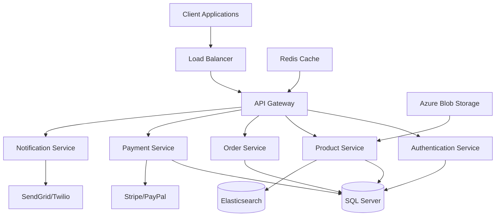

### Service Layer Architecture

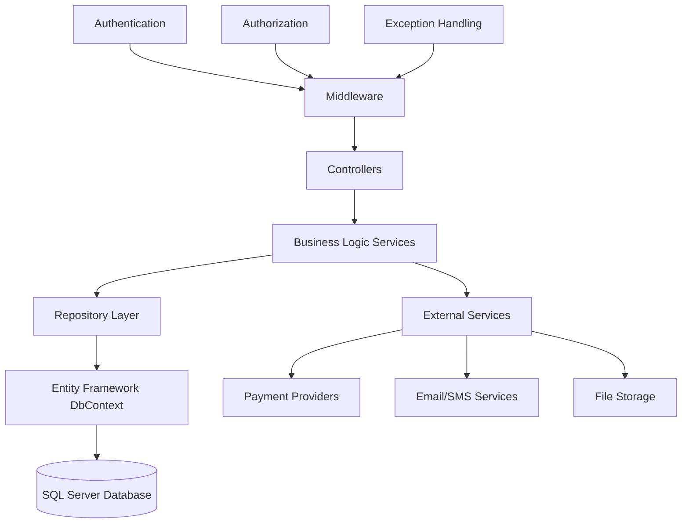

## 4. API Endpoints Reference

### Authentication Endpoints

| Method | Endpoint | Description | Authorization |
|--------|----------|-------------|---------------|
| POST | `/api/auth/register` | User registration | Anonymous |
| POST | `/api/auth/login` | User login | Anonymous |
| POST | `/api/auth/refresh` | Refresh JWT token | Anonymous |
| POST | `/api/auth/logout` | User logout | Authenticated |
| POST | `/api/auth/forgot-password` | Password reset request | Anonymous |
| POST | `/api/auth/reset-password` | Reset password | Anonymous |
| POST | `/api/auth/confirm-email` | Email verification | Anonymous |

### User Management Endpoints

| Method | Endpoint | Description | Authorization |
|--------|----------|-------------|---------------|
| GET | `/api/users/profile` | Get user profile | Authenticated |
| PUT | `/api/users/profile` | Update user profile | Authenticated |
| POST | `/api/users/address` | Add user address | Authenticated |
| PUT | `/api/users/address/{id}` | Update user address | Authenticated |
| DELETE | `/api/users/address/{id}` | Delete user address | Authenticated |
| POST | `/api/users/upload-avatar` | Upload profile image | Authenticated |

### Product Management Endpoints

| Method | Endpoint | Description | Authorization |
|--------|----------|-------------|---------------|
| GET | `/api/products` | List products with filters | Anonymous |
| GET | `/api/products/{id}` | Get product details | Anonymous |
| POST | `/api/products` | Create new product | Vendor/Admin |
| PUT | `/api/products/{id}` | Update product | Vendor/Admin |
| DELETE | `/api/products/{id}` | Delete product | Vendor/Admin |
| POST | `/api/products/{id}/images` | Upload product images | Vendor/Admin |
| GET | `/api/products/search` | Search products | Anonymous |
| GET | `/api/products/categories` | Get product categories | Anonymous |

### Order Management Endpoints

| Method | Endpoint | Description | Authorization |
|--------|----------|-------------|---------------|
| GET | `/api/orders` | Get user orders | Authenticated |
| GET | `/api/orders/{id}` | Get order details | Authenticated |
| POST | `/api/orders` | Create new order | Customer |
| PUT | `/api/orders/{id}/status` | Update order status | Vendor/Admin |
| POST | `/api/orders/{id}/cancel` | Cancel order | Customer/Admin |
| GET | `/api/orders/{id}/tracking` | Get order tracking | Authenticated |

### Cart & Wishlist Endpoints

| Method | Endpoint | Description | Authorization |
|--------|----------|-------------|---------------|
| GET | `/api/cart` | Get cart items | Customer |
| POST | `/api/cart/items` | Add item to cart | Customer |
| PUT | `/api/cart/items/{id}` | Update cart item | Customer |
| DELETE | `/api/cart/items/{id}` | Remove cart item | Customer |
| GET | `/api/wishlist` | Get wishlist items | Customer |
| POST | `/api/wishlist/items` | Add item to wishlist | Customer |
| DELETE | `/api/wishlist/items/{id}` | Remove wishlist item | Customer |

### Payment Endpoints

| Method | Endpoint | Description | Authorization |
|--------|----------|-------------|---------------|
| POST | `/api/payments/process` | Process payment | Customer |
| GET | `/api/payments/{id}` | Get payment details | Authenticated |
| POST | `/api/payments/refund` | Process refund | Admin |
| GET | `/api/payments/methods` | Get payment methods | Customer |

### Review & Rating Endpoints

| Method | Endpoint | Description | Authorization |
|--------|----------|-------------|---------------|
| GET | `/api/products/{id}/reviews` | Get product reviews | Anonymous |
| POST | `/api/products/{id}/reviews` | Create product review | Customer |
| PUT | `/api/reviews/{id}` | Update review | Customer |
| DELETE | `/api/reviews/{id}` | Delete review | Customer/Admin |
| POST | `/api/reviews/{id}/helpful` | Mark review helpful | Customer |

### Vendor Management Endpoints

| Method | Endpoint | Description | Authorization |
|--------|----------|-------------|---------------|
| POST | `/api/vendor/apply` | Apply for vendor status | Customer |
| GET | `/api/vendor/dashboard` | Get vendor dashboard data | Vendor |
| GET | `/api/vendor/orders` | Get vendor orders | Vendor |
| GET | `/api/vendor/products` | Get vendor products | Vendor |
| GET | `/api/vendor/analytics` | Get vendor analytics | Vendor |
| PUT | `/api/vendor/profile` | Update vendor profile | Vendor |

### Administrative Endpoints

| Method | Endpoint | Description | Authorization |
|--------|----------|-------------|---------------|
| GET | `/api/admin/dashboard` | Get admin dashboard | Admin |
| GET | `/api/admin/users` | Get all users | Admin |
| PUT | `/api/admin/users/{id}/status` | Update user status | Admin |
| GET | `/api/admin/vendor-applications` | Get vendor applications | Admin |
| PUT | `/api/admin/vendor-applications/{id}` | Approve/reject vendor | Admin |
| GET | `/api/admin/orders` | Get all orders | Admin |
| GET | `/api/admin/reports` | Generate reports | Admin |

## 5. Data Models & ORM Mapping

### Core Entity Models

#### User Management Models

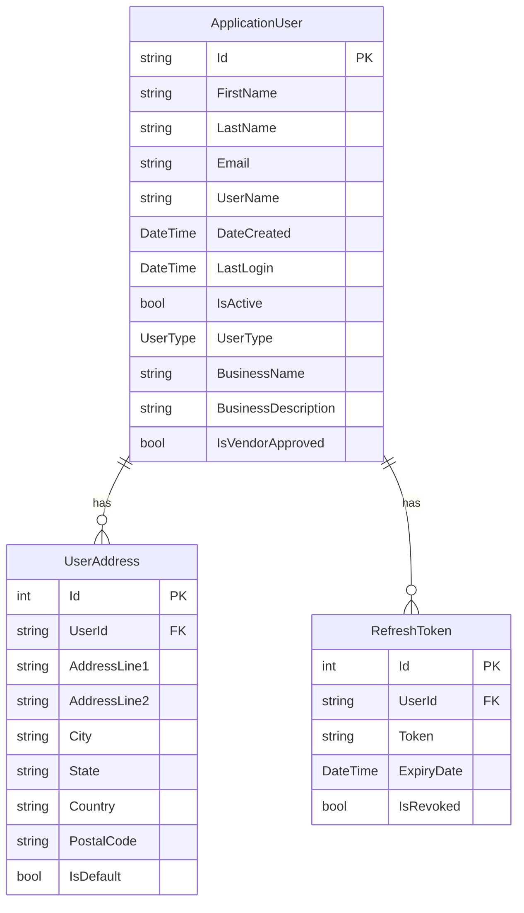

#### Product Management Models

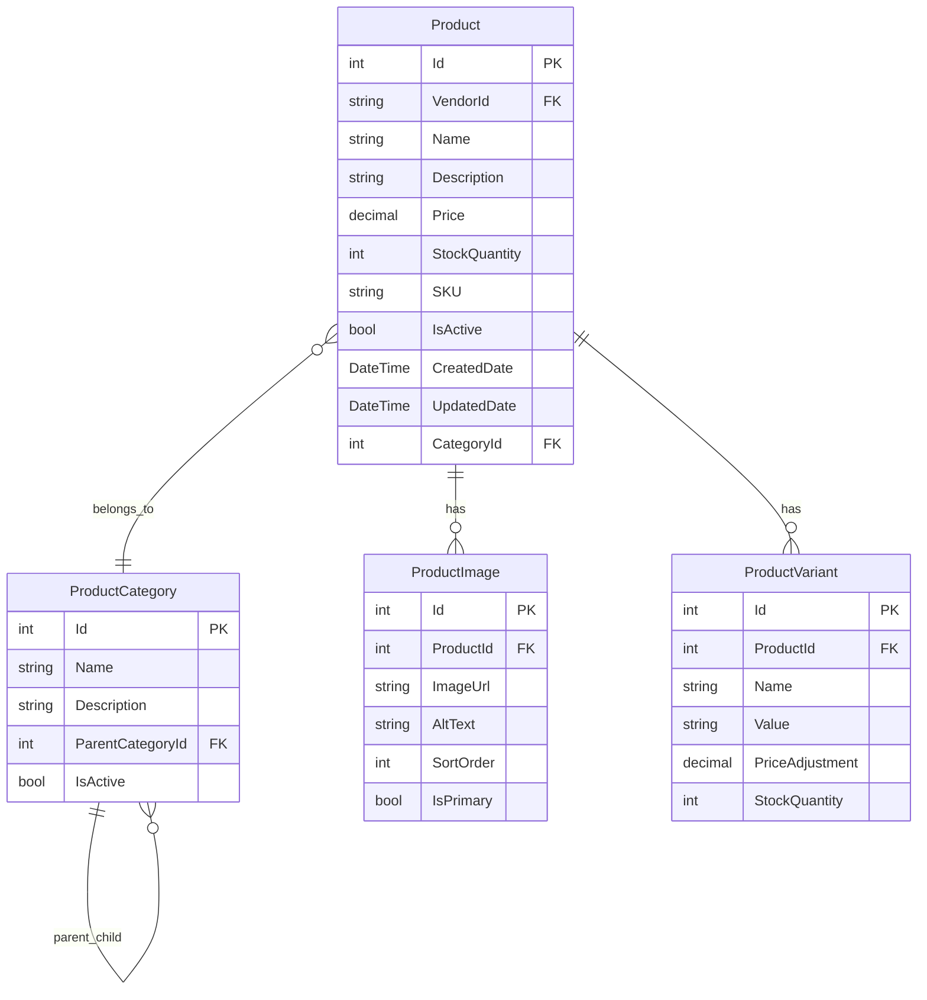

#### Order Management Models

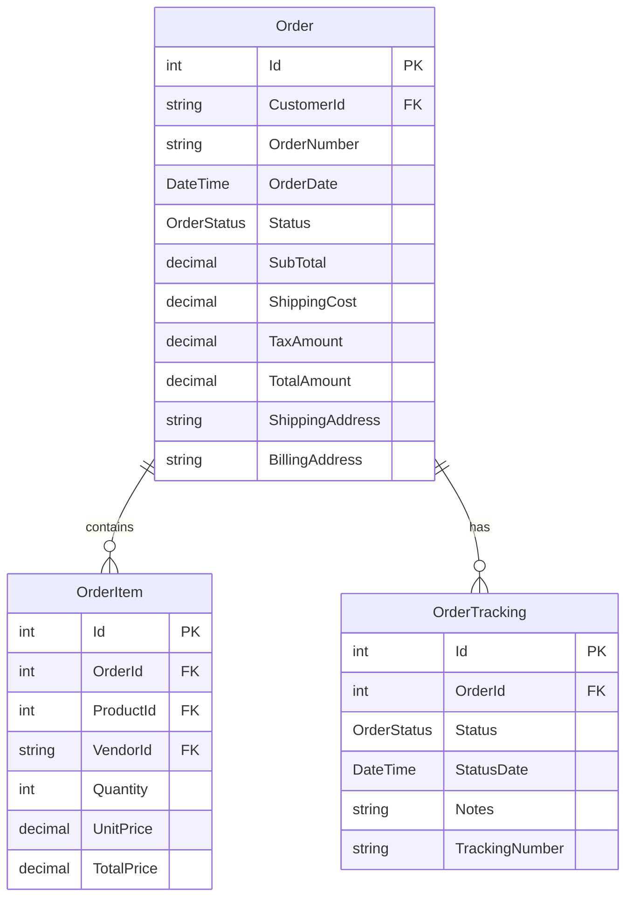

### Entity Framework Configuration

#### ApplicationDbContext Configuration

| Entity | Key Configuration | Indexes | Relationships |
|--------|------------------|---------|---------------|
| ApplicationUser | Identity framework base | UserType, IsActive, IsVendorApproved | One-to-many with UserAddress |
| Product | Primary key: Id | VendorId, CategoryId, IsActive, SKU | Many-to-one with Category, One-to-many with Images |
| Order | Primary key: Id | CustomerId, OrderDate, Status | One-to-many with OrderItems |
| Review | Primary key: Id | ProductId, CustomerId, IsApproved | Many-to-one with Product and User |

## 6. Business Logic Layer

### Authentication & User Management

#### User Registration Flow

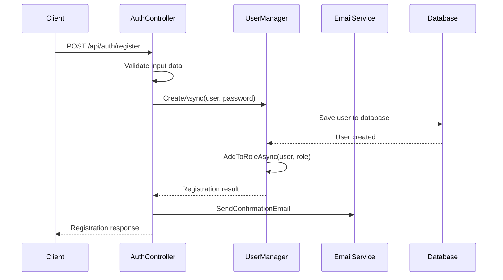

#### JWT Token Management

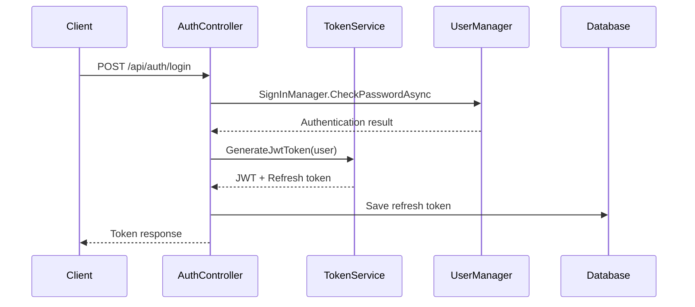

### Product Management

#### Product Creation Workflow

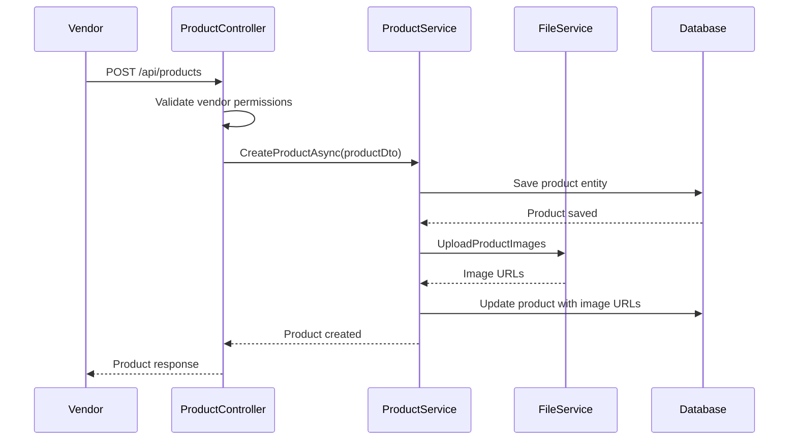

### Order Processing

#### Order Creation Flow

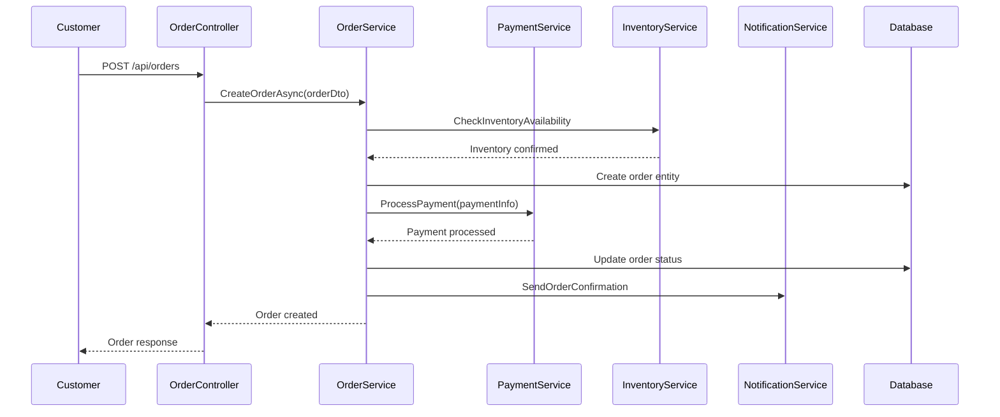

### Payment Processing

#### Payment Integration Architecture

| Payment Provider | Integration Type | Features |
|-----------------|------------------|----------|
| Stripe | REST API | Credit cards, digital wallets, subscriptions |
| PayPal | SDK Integration | PayPal account, credit cards, express checkout |
| Square | REST API | In-person and online payments |

#### Payment Processing Flow

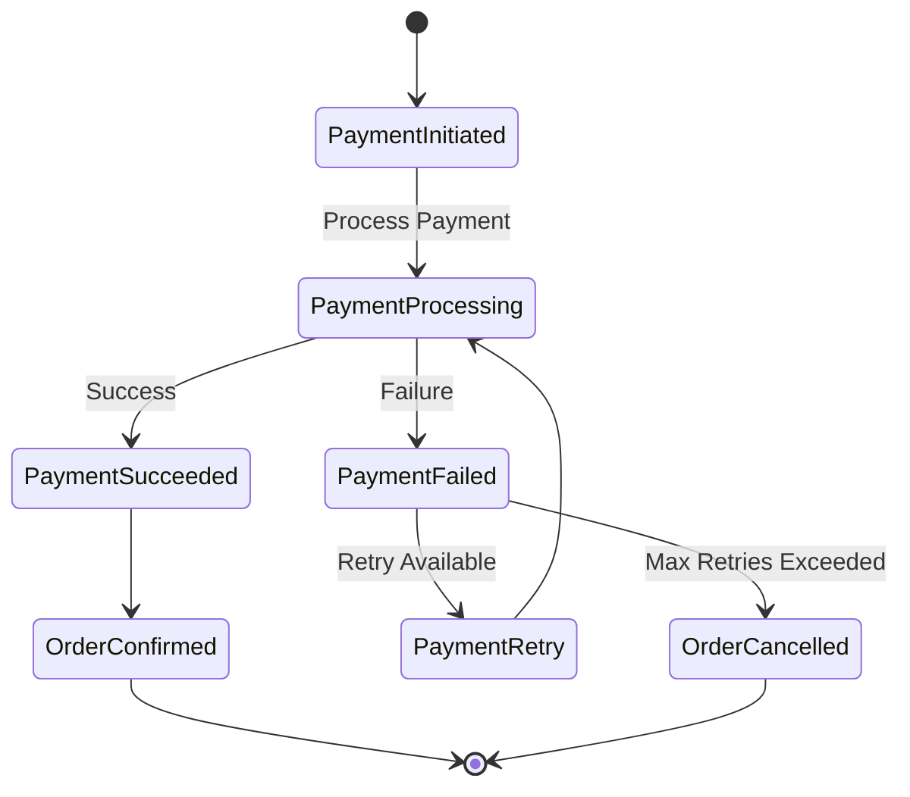

## 7. Middleware & Interceptors

### Custom Middleware Components

| Middleware | Purpose | Order |
|------------|---------|-------|
| ExceptionHandlingMiddleware | Global error handling | 1 |
| AuthenticationMiddleware | JWT token validation | 2 |
| AuthorizationMiddleware | Role-based access control | 3 |
| RequestLoggingMiddleware | API call logging | 4 |
| RateLimitingMiddleware | API throttling | 5 |
| CorsMiddleware | Cross-origin requests | 6 |

### Exception Handling Strategy

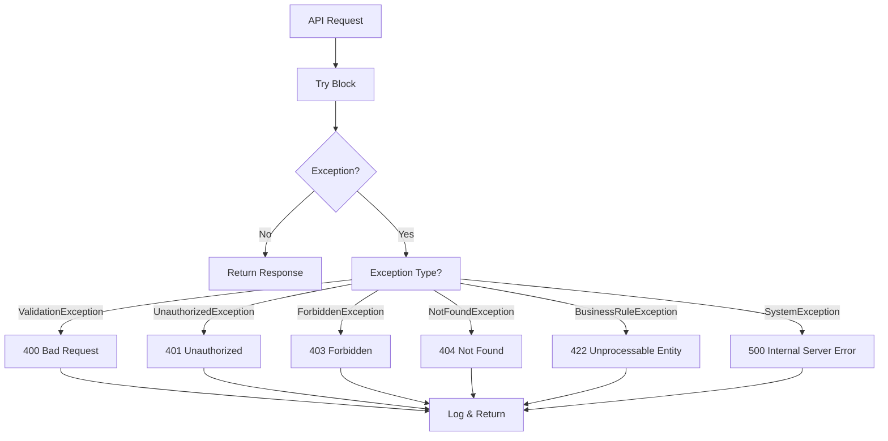

### Authentication & Authorization Flow

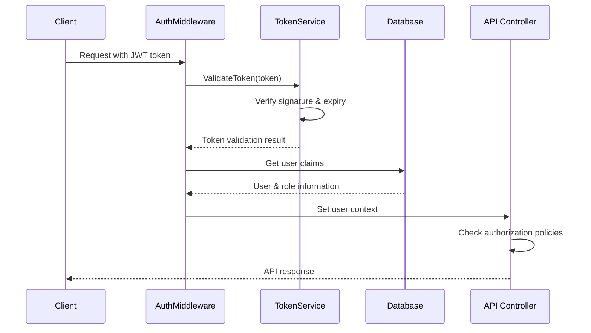

## 8. Testing Strategy

### Unit Testing Structure

| Component | Testing Framework | Coverage Target |
|-----------|------------------|-----------------|
| Controllers | xUnit + Moq | 90%+ |
| Services | xUnit + Moq | 95%+ |
| Repositories | xUnit + InMemoryDatabase | 85%+ |
| Utilities | xUnit | 95%+ |

### Integration Testing

| Test Category | Scope | Tools |
|---------------|-------|-------|
| API Integration | Controller endpoints | WebApplicationFactory |
| Database Integration | EF Core operations | TestContainers |
| External Services | Payment/Email APIs | WireMock |

### Test Data Management

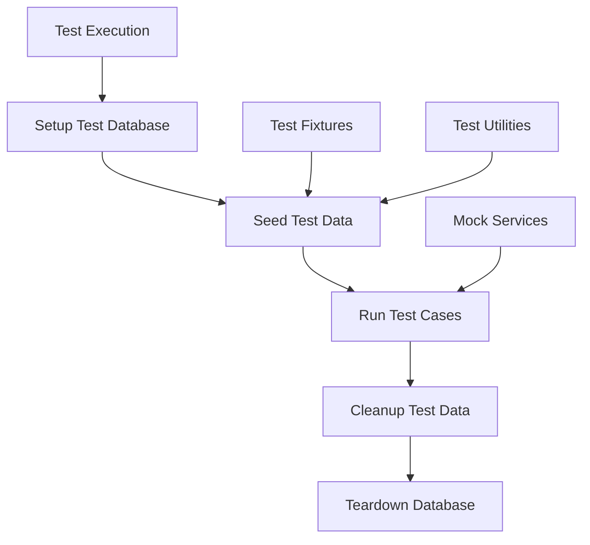

### API Testing Strategy

| Testing Type | Implementation | Purpose |
|--------------|---------------|---------|
| Controller Tests | Unit tests with mocked dependencies | Validate request/response handling |
| Service Tests | Unit tests with mocked repositories | Test business logic |
| Integration Tests | End-to-end API calls | Validate complete workflows |
| Performance Tests | Load testing with NBomber | Validate scalability requirements |

### Authentication Testing

```mermaid
graph TD
    A[Authentication Tests] --> B[Registration Tests]
    A --> C[Login Tests]
    A --> D[Token Tests]
    A --> E[Authorization Tests]
    
    B --> B1[Valid Registration]
    B --> B2[Duplicate Email]
    B --> B3[Invalid Data]
    
    C --> C1[Valid Credentials]
    C --> C2[Invalid Credentials]
    C --> C3[Account Locked]
    
    D --> D1[Token Generation]
    D --> D2[Token Refresh]
    D --> D3[Token Expiry]
    
    E --> E1[Role-based Access]
    E --> E2[Resource Authorization]
    E --> E3[Permission Validation]
```### Product Management Endpoints

| Method | Endpoint | Description | Authorization |
|--------|----------|-------------|---------------|
| GET | `/api/products` | List products with filters | Anonymous |
| GET | `/api/products/{id}` | Get product details | Anonymous |
| POST | `/api/products` | Create new product | Vendor/Admin |
| PUT | `/api/products/{id}` | Update product | Vendor/Admin |
| DELETE | `/api/products/{id}` | Delete product | Vendor/Admin |
| POST | `/api/products/{id}/images` | Upload product images | Vendor/Admin |
| GET | `/api/products/search` | Search products | Anonymous |
| GET | `/api/products/categories` | Get product categories | Anonymous |

### Order Management Endpoints

| Method | Endpoint | Description | Authorization |
|--------|----------|-------------|---------------|
| GET | `/api/orders` | Get user orders | Authenticated |
| GET | `/api/orders/{id}` | Get order details | Authenticated |
| POST | `/api/orders` | Create new order | Customer |
| PUT | `/api/orders/{id}/status` | Update order status | Vendor/Admin |
| POST | `/api/orders/{id}/cancel` | Cancel order | Customer/Admin |
| GET | `/api/orders/{id}/tracking` | Get order tracking | Authenticated |

### Cart & Wishlist Endpoints

| Method | Endpoint | Description | Authorization |
|--------|----------|-------------|---------------|
| GET | `/api/cart` | Get cart items | Customer |
| POST | `/api/cart/items` | Add item to cart | Customer |
| PUT | `/api/cart/items/{id}` | Update cart item | Customer |
| DELETE | `/api/cart/items/{id}` | Remove cart item | Customer |
| GET | `/api/wishlist` | Get wishlist items | Customer |
| POST | `/api/wishlist/items` | Add item to wishlist | Customer |
| DELETE | `/api/wishlist/items/{id}` | Remove wishlist item | Customer |

### Payment Endpoints

| Method | Endpoint | Description | Authorization |
|--------|----------|-------------|---------------|
| POST | `/api/payments/process` | Process payment | Customer |
| GET | `/api/payments/{id}` | Get payment details | Authenticated |
| POST | `/api/payments/refund` | Process refund | Admin |
| GET | `/api/payments/methods` | Get payment methods | Customer |

### Review & Rating Endpoints

| Method | Endpoint | Description | Authorization |
|--------|----------|-------------|---------------|
| GET | `/api/products/{id}/reviews` | Get product reviews | Anonymous |
| POST | `/api/products/{id}/reviews` | Create product review | Customer |
| PUT | `/api/reviews/{id}` | Update review | Customer |
| DELETE | `/api/reviews/{id}` | Delete review | Customer/Admin |
| POST | `/api/reviews/{id}/helpful` | Mark review helpful | Customer |

### Vendor Management Endpoints

| Method | Endpoint | Description | Authorization |
|--------|----------|-------------|---------------|
| POST | `/api/vendor/apply` | Apply for vendor status | Customer |
| GET | `/api/vendor/dashboard` | Get vendor dashboard data | Vendor |
| GET | `/api/vendor/orders` | Get vendor orders | Vendor |
| GET | `/api/vendor/products` | Get vendor products | Vendor |
| GET | `/api/vendor/analytics` | Get vendor analytics | Vendor |
| PUT | `/api/vendor/profile` | Update vendor profile | Vendor |

### Administrative Endpoints

| Method | Endpoint | Description | Authorization |
|--------|----------|-------------|---------------|
| GET | `/api/admin/dashboard` | Get admin dashboard | Admin |
| GET | `/api/admin/users` | Get all users | Admin |
| PUT | `/api/admin/users/{id}/status` | Update user status | Admin |
| GET | `/api/admin/vendor-applications` | Get vendor applications | Admin |
| PUT | `/api/admin/vendor-applications/{id}` | Approve/reject vendor | Admin |
| GET | `/api/admin/orders` | Get all orders | Admin |
| GET | `/api/admin/reports` | Generate reports | Admin |

## 5. Data Models & ORM Mapping

### Core Entity Models

#### User Management Models

```mermaid
erDiagram
    ApplicationUser {
        string Id PK
        string FirstName
        string LastName
        string Email
        string UserName
        DateTime DateCreated
        DateTime LastLogin
        bool IsActive
        UserType UserType
        string BusinessName
        string BusinessDescription
        bool IsVendorApproved
    }
    
    UserAddress {
        int Id PK
        string UserId FK
        string AddressLine1
        string AddressLine2
        string City
        string State
        string Country
        string PostalCode
        bool IsDefault
    }
    
    RefreshToken {
        int Id PK
        string UserId FK
        string Token
        DateTime ExpiryDate
        bool IsRevoked
    }
    
    ApplicationUser ||--o{ UserAddress : has
    ApplicationUser ||--o{ RefreshToken : has
```

#### Product Management Models


#### Order Management Models


### Entity Framework Configuration

#### ApplicationDbContext Configuration

| Entity | Key Configuration | Indexes | Relationships |
|--------|------------------|---------|---------------|
| ApplicationUser | Identity framework base | UserType, IsActive, IsVendorApproved | One-to-many with UserAddress |
| Product | Primary key: Id | VendorId, CategoryId, IsActive, SKU | Many-to-one with Category, One-to-many with Images |
| Order | Primary key: Id | CustomerId, OrderDate, Status | One-to-many with OrderItems |
| Review | Primary key: Id | ProductId, CustomerId, IsApproved | Many-to-one with Product and User |

## 6. Business Logic Layer

### Authentication & User Management

#### User Registration Flow


#### JWT Token Management


### Product Management

#### Product Creation Workflow


### Order Processing

#### Order Creation Flow


### Payment Processing

#### Payment Integration Architecture

| Payment Provider | Integration Type | Features |
|-----------------|------------------|----------|
| Stripe | REST API | Credit cards, digital wallets, subscriptions |
| PayPal | SDK Integration | PayPal account, credit cards, express checkout |
| Square | REST API | In-person and online payments |

#### Payment Processing Flow

```mermaid
stateDiagram-v2
    [*] --> PaymentInitiated
    PaymentInitiated --> PaymentProcessing: Process Payment
    PaymentProcessing --> PaymentSucceeded: Success
    PaymentProcessing --> PaymentFailed: Failure
    PaymentSucceeded --> OrderConfirmed
    PaymentFailed --> PaymentRetry: Retry Available
    PaymentFailed --> OrderCancelled: Max Retries Exceeded
    PaymentRetry --> PaymentProcessing
    OrderConfirmed --> [*]
    OrderCancelled --> [*]
```

## 7. Middleware & Interceptors

### Custom Middleware Components

| Middleware | Purpose | Order |
|------------|---------|-------|
| ExceptionHandlingMiddleware | Global error handling | 1 |
| AuthenticationMiddleware | JWT token validation | 2 |
| AuthorizationMiddleware | Role-based access control | 3 |
| RequestLoggingMiddleware | API call logging | 4 |
| RateLimitingMiddleware | API throttling | 5 |
| CorsMiddleware | Cross-origin requests | 6 |

### Exception Handling Strategy

```mermaid
flowchart TD
    A[API Request] --> B[Try Block]
    B --> C{Exception?}
    C -->|No| D[Return Response]
    C -->|Yes| E[Exception Type?]
    E -->|ValidationException| F[400 Bad Request]
    E -->|UnauthorizedException| G[401 Unauthorized]
    E -->|ForbiddenException| H[403 Forbidden]
    E -->|NotFoundException| I[404 Not Found]
    E -->|BusinessRuleException| J[422 Unprocessable Entity]
    E -->|SystemException| K[500 Internal Server Error]
    F --> L[Log & Return]
    G --> L
    H --> L
    I --> L
    J --> L
    K --> L
```

### Authentication & Authorization Flow

```mermaid
sequenceDiagram
    participant C as Client
    participant M as AuthMiddleware
    participant T as TokenService
    participant D as Database
    participant A as API Controller
    
    C->>M: Request with JWT token
    M->>T: ValidateToken(token)
    T->>T: Verify signature & expiry
    T-->>M: Token validation result
    M->>D: Get user claims
    D-->>M: User & role information
    M->>A: Set user context
    A->>A: Check authorization policies
    A-->>C: API response
```

## 8. Testing Strategy

### Unit Testing Structure

| Component | Testing Framework | Coverage Target |
|-----------|------------------|-----------------|
| Controllers | xUnit + Moq | 90%+ |
| Services | xUnit + Moq | 95%+ |
| Repositories | xUnit + InMemoryDatabase | 85%+ |
| Utilities | xUnit | 95%+ |

### Integration Testing

| Test Category | Scope | Tools |
|---------------|-------|-------|
| API Integration | Controller endpoints | WebApplicationFactory |
| Database Integration | EF Core operations | TestContainers |
| External Services | Payment/Email APIs | WireMock |

### Test Data Management

```mermaid
flowchart TD
    A[Test Execution] --> B[Setup Test Database]
    B --> C[Seed Test Data]
    C --> D[Run Test Cases]
    D --> E[Cleanup Test Data]
    E --> F[Teardown Database]
    
    G[Test Fixtures] --> C
    H[Mock Services] --> D
    I[Test Utilities] --> C
```

### API Testing Strategy

| Testing Type | Implementation | Purpose |
|--------------|---------------|---------|
| Controller Tests | Unit tests with mocked dependencies | Validate request/response handling |
| Service Tests | Unit tests with mocked repositories | Test business logic |
| Integration Tests | End-to-end API calls | Validate complete workflows |
| Performance Tests | Load testing with NBomber | Validate scalability requirements |

### Authentication Testing

```mermaid
graph TD
    A[Authentication Tests] --> B[Registration Tests]
    A --> C[Login Tests]
    A --> D[Token Tests]
    A --> E[Authorization Tests]
    
    B --> B1[Valid Registration]
    B --> B2[Duplicate Email]
    B --> B3[Invalid Data]
    
    C --> C1[Valid Credentials]
    C --> C2[Invalid Credentials]
    C --> C3[Account Locked]
    
    D --> D1[Token Generation]
    D --> D2[Token Refresh]
    D --> D3[Token Expiry]
    
    E --> E1[Role-based Access]
    E --> E2[Resource Authorization]
    E --> E3[Permission Validation]
```


