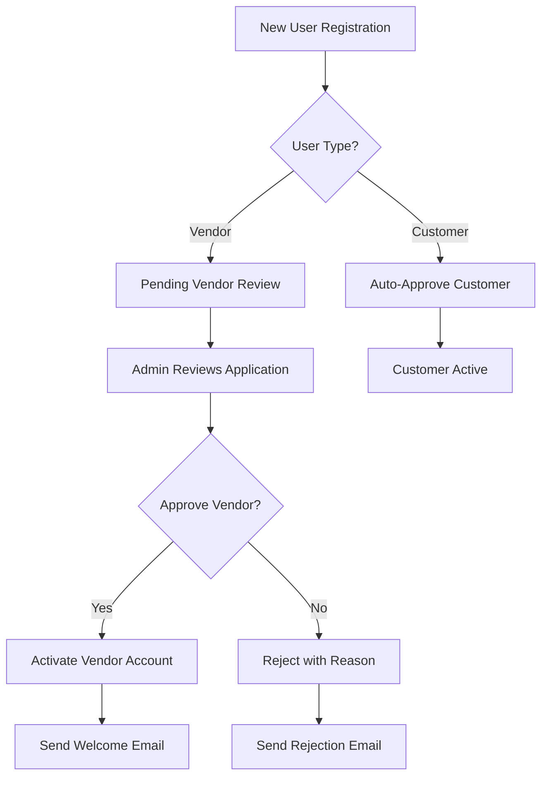
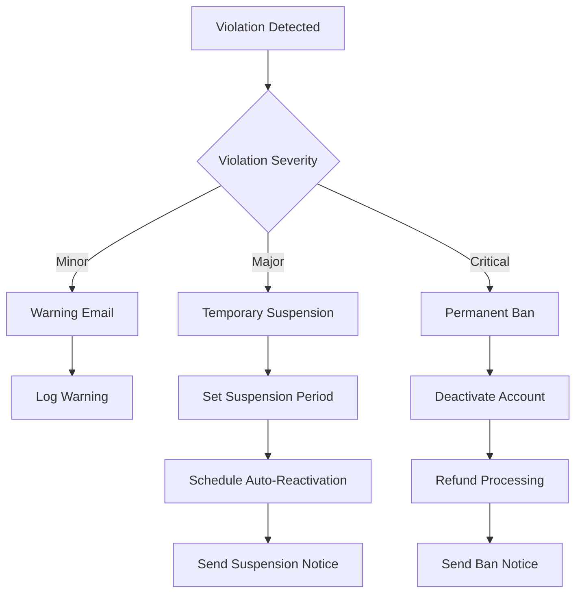
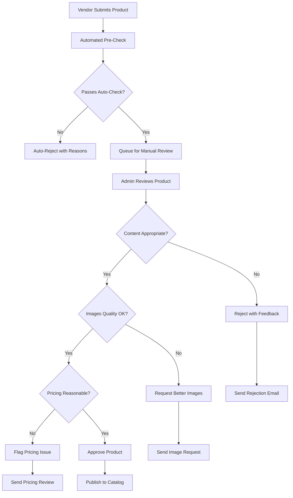
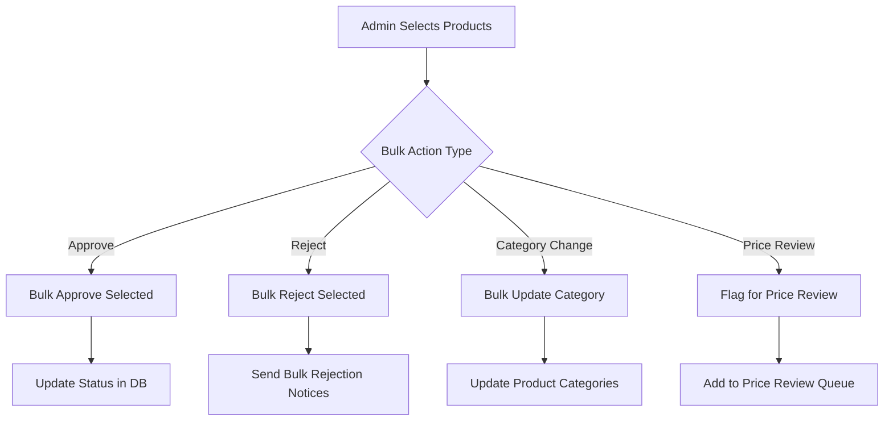
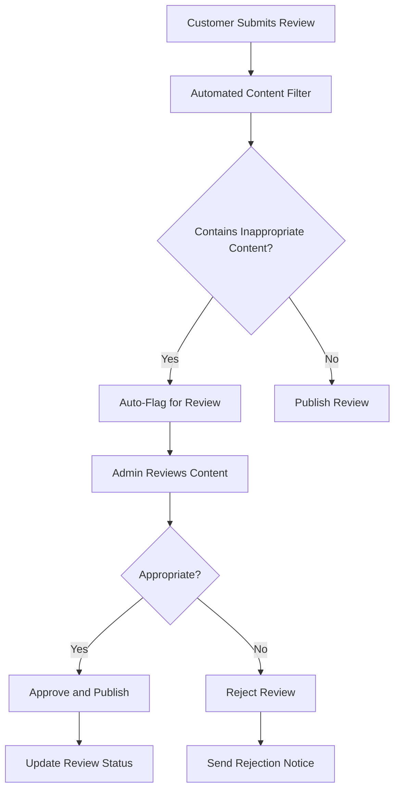
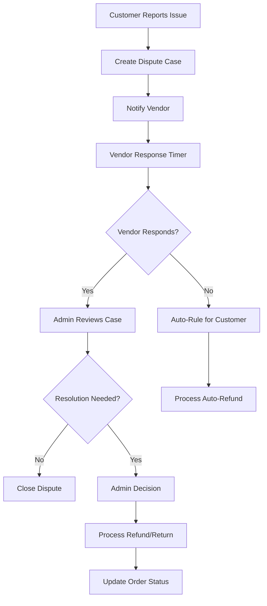
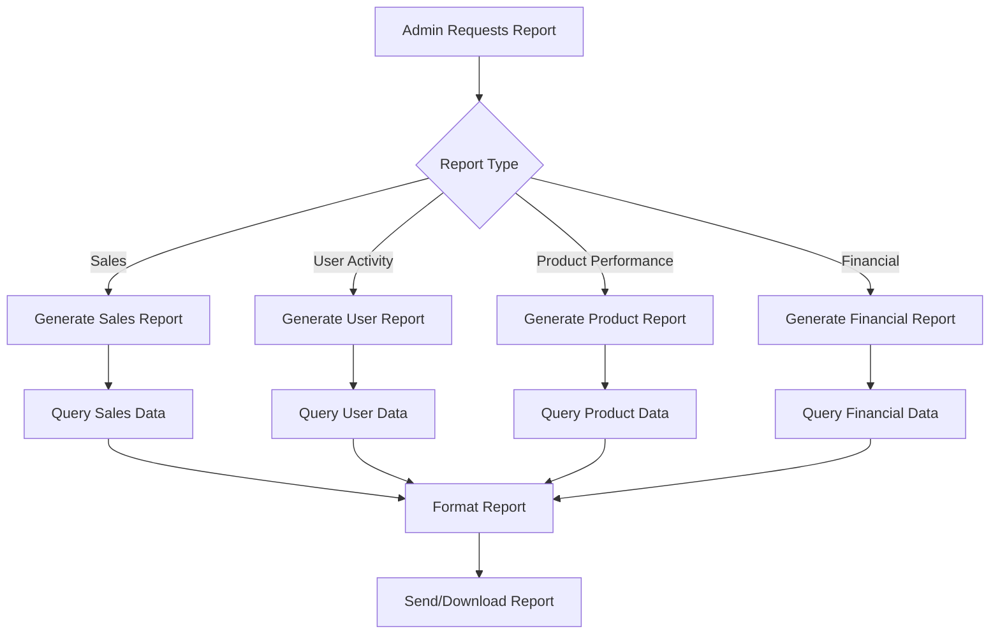

# Admin Workflow and Server-Side Specification
## Kasuwa Online Marketplace Platform

**Document Version:** 1.0  
**Date:** September 14, 2025  
**Based on:** PRD_Online_Marketplace_Platform.md v1.0  

---

## Table of Contents

1. [Executive Summary](#1-executive-summary)
2. [Admin Role Overview](#2-admin-role-overview)
3. [Administrative Workflows](#3-administrative-workflows)
4. [Server-Side Architecture](#4-server-side-architecture)
5. [API Specifications](#5-api-specifications)
6. [Data Models](#6-data-models)
7. [Security & Authorization](#7-security--authorization)
8. [Audit & Logging](#8-audit--logging)
9. [Performance Considerations](#9-performance-considerations)
10. [Implementation Guidelines](#10-implementation-guidelines)

---

## 1. Executive Summary

### 1.1 Purpose
This document defines the comprehensive server-side workflow and technical specifications for administrative functions in the Kasuwa Online Marketplace Platform. It serves as the technical blueprint for implementing all admin-related features, APIs, and workflows.

### 1.2 Scope
The document covers:
- Complete admin workflow processes
- Server-side API endpoints and controllers
- Database schema for admin operations
- Security and authorization models
- Audit trails and logging requirements
- Performance optimization strategies

### 1.3 Key Admin Responsibilities
Based on the PRD requirements (FR-051 to FR-056), administrators will manage:
- User account lifecycle and access control
- Product listing moderation and approval
- Review and content moderation
- Sales analytics and business reporting
- Platform configuration and settings
- Commission structures and fee management

---

## 2. Admin Role Overview

### 2.1 Admin Personas

#### 2.1.1 Super Administrator
**Responsibilities:**
- Full system access and configuration
- User role management
- Platform settings configuration
- Security policy enforcement
- System monitoring and maintenance

**Access Level:** Full administrative privileges

#### 2.1.2 Content Moderator
**Responsibilities:**
- Product listing review and approval
- Content moderation (reviews, descriptions)
- Vendor verification processes
- Quality assurance for listings

**Access Level:** Content management privileges

#### 2.1.3 Customer Support Admin
**Responsibilities:**
- User account management (suspend/activate)
- Order dispute resolution
- Customer service escalations
- Refund and return processing

**Access Level:** User management and order privileges

#### 2.1.4 Business Analyst Admin
**Responsibilities:**
- Analytics and reporting access
- Sales performance monitoring
- Commission and fee tracking
- Business intelligence insights

**Access Level:** Read-only analytics privileges

### 2.2 Admin Core Functions Matrix

| Function | Super Admin | Content Mod | Support Admin | Business Analyst |
|----------|-------------|-------------|---------------|------------------|
| User Management | ✓ | ✗ | ✓ | ✗ |
| Product Moderation | ✓ | ✓ | ✗ | ✗ |
| Order Management | ✓ | ✗ | ✓ | ✗ |
| Analytics & Reporting | ✓ | ✗ | ✗ | ✓ |
| Platform Configuration | ✓ | ✗ | ✗ | ✗ |
| Commission Management | ✓ | ✗ | ✗ | ✓ |

---

## 3. Administrative Workflows

### 3.1 User Account Management Workflow

#### 3.1.1 User Registration Approval Process


**Workflow Steps:**
1. **Registration Submission**: User submits registration with required documents
2. **Initial Validation**: System validates email, documents, and basic requirements
3. **Admin Queue**: Vendor applications added to admin review queue
4. **Document Review**: Admin reviews business license, tax ID, identity verification
5. **Background Check**: Optional background verification for high-risk categories
6. **Decision**: Approve, reject, or request additional information
7. **Notification**: Automated email notification to applicant
8. **Account Activation**: If approved, account status updated to active

#### 3.1.2 User Suspension/Deactivation Process


**Suspension Triggers:**
- Multiple customer complaints
- Fraudulent activity detection
- Policy violations
- Payment disputes
- Fake product listings

### 3.2 Product Moderation Workflow

#### 3.2.1 Product Listing Approval Process


**Moderation Criteria:**
- Content appropriateness and accuracy
- Image quality and relevance
- Pricing reasonableness
- Category classification accuracy
- Compliance with platform policies

#### 3.2.2 Bulk Product Management


### 3.3 Review and Content Moderation Workflow

#### 3.3.1 Review Moderation Process


**Content Filtering Criteria:**
- Profanity and inappropriate language
- Personal information disclosure
- Spam or promotional content
- Off-topic or irrelevant content
- Fake or suspicious reviews

### 3.4 Order Management and Dispute Resolution

#### 3.4.1 Order Dispute Workflow


### 3.5 Analytics and Reporting Workflow

#### 3.5.1 Report Generation Process


---

## 4. Server-Side Architecture

### 4.1 Admin Module Architecture

```
┌─────────────────────────────────────────────────────────────┐
│                    Admin API Layer                         │
├─────────────────────────────────────────────────────────────┤
│  UserManagement │ ProductModeration │ OrderManagement      │
│  Controller     │ Controller        │ Controller           │
├─────────────────────────────────────────────────────────────┤
│  Analytics      │ Configuration     │ AuditLog            │
│  Controller     │ Controller        │ Controller           │
├─────────────────────────────────────────────────────────────┤
│                   Service Layer                            │
├─────────────────────────────────────────────────────────────┤
│  AdminUserService    │ ModerationService                   │
│  ReportingService    │ AuditService                        │
├─────────────────────────────────────────────────────────────┤
│                Repository Pattern                          │
├─────────────────────────────────────────────────────────────┤
│  UserRepository      │ ProductRepository                   │
│  OrderRepository     │ AuditRepository                     │
├─────────────────────────────────────────────────────────────┤
│                   Data Access Layer                        │
├─────────────────────────────────────────────────────────────┤
│                Entity Framework Core                        │
├─────────────────────────────────────────────────────────────┤
│                     SQL Server                             │
└─────────────────────────────────────────────────────────────┘
```

### 4.2 Key Service Components

#### 4.2.1 AdminUserService
**Responsibilities:**
- User account lifecycle management
- Role and permission assignment
- Vendor verification processes
- Account suspension/activation

**Key Methods:**
```csharp
Task<UserDto> GetUserByIdAsync(int userId);
Task<PagedResult<UserDto>> GetUsersAsync(UserFilterDto filter);
Task<bool> ApproveVendorAsync(int userId, ApprovalDto approval);
Task<bool> SuspendUserAsync(int userId, SuspensionDto suspension);
Task<bool> ActivateUserAsync(int userId);
Task<List<UserActivityDto>> GetUserActivityAsync(int userId);
```

#### 4.2.2 ModerationService
**Responsibilities:**
- Product listing moderation
- Content review and approval
- Batch moderation operations
- Quality assurance processes

**Key Methods:**
```csharp
Task<PagedResult<ProductDto>> GetPendingProductsAsync(ModerationFilterDto filter);
Task<bool> ApproveProductAsync(int productId, ApprovalDto approval);
Task<bool> RejectProductAsync(int productId, RejectionDto rejection);
Task<bool> BulkModerateProductsAsync(BulkModerationDto bulkAction);
Task<PagedResult<ReviewDto>> GetPendingReviewsAsync(ReviewFilterDto filter);
```

#### 4.2.3 ReportingService
**Responsibilities:**
- Business analytics generation
- Sales performance reports
- User engagement metrics
- Financial reporting

**Key Methods:**
```csharp
Task<SalesReportDto> GenerateSalesReportAsync(ReportParametersDto parameters);
Task<UserActivityReportDto> GenerateUserActivityReportAsync(DateRangeDto dateRange);
Task<ProductPerformanceReportDto> GenerateProductReportAsync(ProductReportParametersDto parameters);
Task<FinancialReportDto> GenerateFinancialReportAsync(FinancialReportParametersDto parameters);
```

#### 4.2.4 AuditService
**Responsibilities:**
- Audit trail logging
- Admin action tracking
- Security event monitoring
- Compliance reporting

**Key Methods:**
```csharp
Task LogAdminActionAsync(AdminActionDto action);
Task<PagedResult<AuditLogDto>> GetAuditLogsAsync(AuditFilterDto filter);
Task<SecurityReportDto> GenerateSecurityReportAsync(DateRangeDto dateRange);
```

---

## 5. API Specifications

### 5.1 User Management APIs

#### 5.1.1 Get Users
```http
GET /api/admin/users
Authorization: Bearer {admin_token}
```

**Query Parameters:**
```csharp
public class UserFilterDto
{
    public string? SearchTerm { get; set; }
    public UserRole? Role { get; set; }
    public UserStatus? Status { get; set; }
    public DateTime? CreatedFrom { get; set; }
    public DateTime? CreatedTo { get; set; }
    public int Page { get; set; } = 1;
    public int PageSize { get; set; } = 20;
    public string? SortBy { get; set; } = "CreatedAt";
    public SortDirection SortDirection { get; set; } = SortDirection.Desc;
}
```

**Response:**
```json
{
  "success": true,
  "data": {
    "items": [
      {
        "id": 1,
        "email": "vendor@example.com",
        "firstName": "John",
        "lastName": "Doe",
        "role": "Vendor",
        "status": "Active",
        "createdAt": "2025-09-01T10:00:00Z",
        "lastLoginAt": "2025-09-14T08:30:00Z",
        "verificationStatus": "Verified",
        "totalOrders": 145,
        "totalSales": 25000.00
      }
    ],
    "totalCount": 1,
    "currentPage": 1,
    "totalPages": 1,
    "pageSize": 20
  }
}
```

#### 5.1.2 Approve Vendor
```http
POST /api/admin/users/{userId}/approve
Authorization: Bearer {admin_token}
Content-Type: application/json
```

**Request Body:**
```json
{
  "approvalNotes": "All documents verified successfully",
  "commissionRate": 5.0,
  "specialPermissions": ["bulk_upload", "featured_listings"]
}
```

**Response:**
```json
{
  "success": true,
  "message": "Vendor approved successfully",
  "data": {
    "userId": 123,
    "status": "Active",
    "approvedAt": "2025-09-14T10:00:00Z",
    "approvedBy": "admin@kasuwa.com"
  }
}
```

#### 5.1.3 Suspend User
```http
POST /api/admin/users/{userId}/suspend
Authorization: Bearer {admin_token}
Content-Type: application/json
```

**Request Body:**
```json
{
  "reason": "Multiple policy violations",
  "suspensionType": "Temporary",
  "duration": "P30D",
  "notifyUser": true,
  "freezeOrders": true
}
```

### 5.2 Product Moderation APIs

#### 5.2.1 Get Pending Products
```http
GET /api/admin/products/pending
Authorization: Bearer {admin_token}
```

**Query Parameters:**
```csharp
public class ModerationFilterDto
{
    public string? SearchTerm { get; set; }
    public int? CategoryId { get; set; }
    public int? VendorId { get; set; }
    public DateTime? SubmittedFrom { get; set; }
    public DateTime? SubmittedTo { get; set; }
    public decimal? PriceFrom { get; set; }
    public decimal? PriceTo { get; set; }
    public int Page { get; set; } = 1;
    public int PageSize { get; set; } = 20;
}
```

**Response:**
```json
{
  "success": true,
  "data": {
    "items": [
      {
        "id": 456,
        "title": "Premium Wireless Headphones",
        "vendorId": 123,
        "vendorName": "TechStore Ltd",
        "category": "Electronics",
        "price": 199.99,
        "submittedAt": "2025-09-14T09:00:00Z",
        "status": "PendingReview",
        "flaggedIssues": [],
        "imageCount": 5,
        "description": "High-quality wireless headphones with noise cancellation..."
      }
    ],
    "totalCount": 15,
    "currentPage": 1,
    "totalPages": 1,
    "pageSize": 20
  }
}
```

#### 5.2.2 Approve Product
```http
POST /api/admin/products/{productId}/approve
Authorization: Bearer {admin_token}
Content-Type: application/json
```

**Request Body:**
```json
{
  "moderatorNotes": "Product meets all quality standards",
  "featuredEligible": true,
  "categoryCorrection": null
}
```

#### 5.2.3 Bulk Moderate Products
```http
POST /api/admin/products/bulk-moderate
Authorization: Bearer {admin_token}
Content-Type: application/json
```

**Request Body:**
```json
{
  "productIds": [123, 456, 789],
  "action": "Approve",
  "notes": "Batch approval for verified vendors",
  "applyToAll": false
}
```

### 5.3 Order Management APIs

#### 5.3.1 Get Disputed Orders
```http
GET /api/admin/orders/disputes
Authorization: Bearer {admin_token}
```

**Response:**
```json
{
  "success": true,
  "data": {
    "items": [
      {
        "orderId": 12345,
        "customerId": 678,
        "customerName": "Jane Smith",
        "vendorId": 123,
        "vendorName": "TechStore Ltd",
        "disputeReason": "Item not as described",
        "disputeDate": "2025-09-13T14:30:00Z",
        "status": "UnderReview",
        "orderAmount": 199.99,
        "requestedRefund": 199.99
      }
    ]
  }
}
```

#### 5.3.2 Resolve Dispute
```http
POST /api/admin/orders/{orderId}/resolve-dispute
Authorization: Bearer {admin_token}
Content-Type: application/json
```

**Request Body:**
```json
{
  "resolution": "RefundCustomer",
  "refundAmount": 199.99,
  "adminNotes": "Product photos did not match actual item",
  "notifyParties": true,
  "vendorPenalty": false
}
```

### 5.4 Analytics and Reporting APIs

#### 5.4.1 Sales Report
```http
GET /api/admin/reports/sales
Authorization: Bearer {admin_token}
```

**Query Parameters:**
```csharp
public class SalesReportParametersDto
{
    public DateTime StartDate { get; set; }
    public DateTime EndDate { get; set; }
    public string Granularity { get; set; } = "Daily"; // Daily, Weekly, Monthly
    public int? VendorId { get; set; }
    public int? CategoryId { get; set; }
    public string Format { get; set; } = "Json"; // Json, Csv, Excel
}
```

**Response:**
```json
{
  "success": true,
  "data": {
    "reportPeriod": {
      "startDate": "2025-09-01T00:00:00Z",
      "endDate": "2025-09-14T23:59:59Z"
    },
    "summary": {
      "totalSales": 125000.00,
      "totalOrders": 1250,
      "averageOrderValue": 100.00,
      "totalCommission": 6250.00
    },
    "salesByDay": [
      {
        "date": "2025-09-14",
        "sales": 8500.00,
        "orders": 85,
        "commission": 425.00
      }
    ],
    "topVendors": [
      {
        "vendorId": 123,
        "vendorName": "TechStore Ltd",
        "sales": 15000.00,
        "orders": 150,
        "commission": 750.00
      }
    ]
  }
}
```

#### 5.4.2 User Activity Report
```http
GET /api/admin/reports/user-activity
Authorization: Bearer {admin_token}
```

**Response:**
```json
{
  "success": true,
  "data": {
    "totalUsers": 5000,
    "activeUsers": 3500,
    "newRegistrations": 150,
    "usersByRole": {
      "customers": 4500,
      "vendors": 500
    },
    "userActivity": {
      "dailyActiveUsers": 800,
      "weeklyActiveUsers": 2500,
      "monthlyActiveUsers": 3500
    }
  }
}
```

### 5.5 Platform Configuration APIs

#### 5.5.1 Get Platform Settings
```http
GET /api/admin/settings
Authorization: Bearer {admin_token}
```

**Response:**
```json
{
  "success": true,
  "data": {
    "general": {
      "platformName": "Kasuwa Marketplace",
      "defaultCommissionRate": 5.0,
      "minimumOrderAmount": 10.00,
      "taxRate": 8.5
    },
    "moderation": {
      "autoApproveProducts": false,
      "requireVendorVerification": true,
      "reviewModerationEnabled": true
    },
    "payments": {
      "supportedPaymentMethods": ["CreditCard", "PayPal", "BankTransfer"],
      "paymentProcessingFee": 2.9,
      "vendorPayoutSchedule": "Weekly"
    }
  }
}
```

#### 5.5.2 Update Platform Settings
```http
PUT /api/admin/settings
Authorization: Bearer {admin_token}
Content-Type: application/json
```

**Request Body:**
```json
{
  "general": {
    "defaultCommissionRate": 5.5,
    "minimumOrderAmount": 15.00,
    "taxRate": 9.0
  },
  "moderation": {
    "autoApproveProducts": false,
    "requireVendorVerification": true
  }
}
```

---

## 6. Data Models

### 6.1 Core Admin Entities

#### 6.1.1 AdminUser Entity
```csharp
public class AdminUser : BaseEntity
{
    public int Id { get; set; }
    public string Email { get; set; }
    public string PasswordHash { get; set; }
    public string FirstName { get; set; }
    public string LastName { get; set; }
    public AdminRole Role { get; set; }
    public AdminStatus Status { get; set; }
    public DateTime CreatedAt { get; set; }
    public DateTime? LastLoginAt { get; set; }
    public List<string> Permissions { get; set; }
    public int CreatedById { get; set; }
    
    // Navigation Properties
    public virtual ICollection<AuditLog> AuditLogs { get; set; }
    public virtual AdminUser CreatedBy { get; set; }
}

public enum AdminRole
{
    SuperAdmin = 1,
    ContentModerator = 2,
    CustomerSupport = 3,
    BusinessAnalyst = 4
}

public enum AdminStatus
{
    Active = 1,
    Inactive = 2,
    Suspended = 3
}
```

#### 6.1.2 ProductModeration Entity
```csharp
public class ProductModeration : BaseEntity
{
    public int Id { get; set; }
    public int ProductId { get; set; }
    public int ModeratorId { get; set; }
    public ModerationStatus Status { get; set; }
    public DateTime SubmittedAt { get; set; }
    public DateTime? ReviewedAt { get; set; }
    public string? ModeratorNotes { get; set; }
    public List<string> FlaggedIssues { get; set; }
    public bool FeaturedEligible { get; set; }
    public string? RejectionReason { get; set; }
    
    // Navigation Properties
    public virtual Product Product { get; set; }
    public virtual AdminUser Moderator { get; set; }
}

public enum ModerationStatus
{
    PendingReview = 1,
    Approved = 2,
    Rejected = 3,
    RequiresChanges = 4
}
```

#### 6.1.3 UserSuspension Entity
```csharp
public class UserSuspension : BaseEntity
{
    public int Id { get; set; }
    public int UserId { get; set; }
    public int SuspendedById { get; set; }
    public SuspensionType Type { get; set; }
    public string Reason { get; set; }
    public DateTime SuspendedAt { get; set; }
    public DateTime? ExpiresAt { get; set; }
    public bool IsActive { get; set; }
    public bool FreezeOrders { get; set; }
    public string? AdminNotes { get; set; }
    
    // Navigation Properties
    public virtual User User { get; set; }
    public virtual AdminUser SuspendedBy { get; set; }
}

public enum SuspensionType
{
    Warning = 1,
    Temporary = 2,
    Permanent = 3
}
```

#### 6.1.4 OrderDispute Entity
```csharp
public class OrderDispute : BaseEntity
{
    public int Id { get; set; }
    public int OrderId { get; set; }
    public int CustomerId { get; set; }
    public int VendorId { get; set; }
    public int? AssignedAdminId { get; set; }
    public DisputeReason Reason { get; set; }
    public DisputeStatus Status { get; set; }
    public string Description { get; set; }
    public DateTime CreatedAt { get; set; }
    public DateTime? ResolvedAt { get; set; }
    public decimal RequestedRefund { get; set; }
    public decimal? ApprovedRefund { get; set; }
    public string? ResolutionNotes { get; set; }
    
    // Navigation Properties
    public virtual Order Order { get; set; }
    public virtual User Customer { get; set; }
    public virtual User Vendor { get; set; }
    public virtual AdminUser AssignedAdmin { get; set; }
    public virtual ICollection<DisputeMessage> Messages { get; set; }
}

public enum DisputeReason
{
    ItemNotReceived = 1,
    ItemNotAsDescribed = 2,
    DefectiveItem = 3,
    WrongItem = 4,
    RefundRequest = 5,
    Other = 6
}

public enum DisputeStatus
{
    Open = 1,
    UnderReview = 2,
    Resolved = 3,
    Closed = 4,
    Escalated = 5
}
```

#### 6.1.5 AuditLog Entity
```csharp
public class AuditLog : BaseEntity
{
    public int Id { get; set; }
    public int? AdminUserId { get; set; }
    public string Action { get; set; }
    public string EntityType { get; set; }
    public int? EntityId { get; set; }
    public string? OldValues { get; set; }
    public string? NewValues { get; set; }
    public DateTime CreatedAt { get; set; }
    public string IpAddress { get; set; }
    public string UserAgent { get; set; }
    public AuditLogLevel Level { get; set; }
    public string? AdditionalData { get; set; }
    
    // Navigation Properties
    public virtual AdminUser AdminUser { get; set; }
}

public enum AuditLogLevel
{
    Info = 1,
    Warning = 2,
    Error = 3,
    Critical = 4
}
```

#### 6.1.6 PlatformConfiguration Entity
```csharp
public class PlatformConfiguration : BaseEntity
{
    public int Id { get; set; }
    public string ConfigKey { get; set; }
    public string ConfigValue { get; set; }
    public string Category { get; set; }
    public string DataType { get; set; }
    public string? Description { get; set; }
    public bool IsEditable { get; set; }
    public DateTime CreatedAt { get; set; }
    public DateTime UpdatedAt { get; set; }
    public int UpdatedById { get; set; }
    
    // Navigation Properties
    public virtual AdminUser UpdatedBy { get; set; }
}
```

### 6.2 Database Schema Relationships

```sql
-- Core relationship constraints
ALTER TABLE AdminUser ADD CONSTRAINT FK_AdminUser_CreatedBy 
    FOREIGN KEY (CreatedById) REFERENCES AdminUser(Id);

ALTER TABLE ProductModeration ADD CONSTRAINT FK_ProductModeration_Product 
    FOREIGN KEY (ProductId) REFERENCES Product(Id);

ALTER TABLE ProductModeration ADD CONSTRAINT FK_ProductModeration_Moderator 
    FOREIGN KEY (ModeratorId) REFERENCES AdminUser(Id);

ALTER TABLE UserSuspension ADD CONSTRAINT FK_UserSuspension_User 
    FOREIGN KEY (UserId) REFERENCES User(Id);

ALTER TABLE UserSuspension ADD CONSTRAINT FK_UserSuspension_SuspendedBy 
    FOREIGN KEY (SuspendedById) REFERENCES AdminUser(Id);

ALTER TABLE OrderDispute ADD CONSTRAINT FK_OrderDispute_Order 
    FOREIGN KEY (OrderId) REFERENCES [Order](Id);

ALTER TABLE OrderDispute ADD CONSTRAINT FK_OrderDispute_AssignedAdmin 
    FOREIGN KEY (AssignedAdminId) REFERENCES AdminUser(Id);

ALTER TABLE AuditLog ADD CONSTRAINT FK_AuditLog_AdminUser 
    FOREIGN KEY (AdminUserId) REFERENCES AdminUser(Id);
```

---

## 7. Security & Authorization

### 7.1 Role-Based Access Control (RBAC)

#### 7.1.1 Permission Matrix
```csharp
public static class AdminPermissions
{
    // User Management
    public const string ViewUsers = "users.view";
    public const string CreateUsers = "users.create";
    public const string UpdateUsers = "users.update";
    public const string SuspendUsers = "users.suspend";
    public const string DeleteUsers = "users.delete";
    
    // Product Management
    public const string ViewProducts = "products.view";
    public const string ModerateProducts = "products.moderate";
    public const string ApproveProducts = "products.approve";
    public const string RejectProducts = "products.reject";
    public const string DeleteProducts = "products.delete";
    
    // Order Management
    public const string ViewOrders = "orders.view";
    public const string UpdateOrders = "orders.update";
    public const string RefundOrders = "orders.refund";
    public const string CancelOrders = "orders.cancel";
    
    // Analytics & Reporting
    public const string ViewAnalytics = "analytics.view";
    public const string ExportReports = "analytics.export";
    public const string ViewFinancials = "analytics.financials";
    
    // Platform Configuration
    public const string ViewSettings = "settings.view";
    public const string UpdateSettings = "settings.update";
    public const string ManageCommissions = "settings.commissions";
    
    // Audit & Security
    public const string ViewAuditLogs = "audit.view";
    public const string ViewSecurityLogs = "security.view";
    public const string ManageAdmins = "admins.manage";
}
```

#### 7.1.2 Permission Assignment by Role
```csharp
public static class AdminRolePermissions
{
    public static readonly Dictionary<AdminRole, List<string>> RolePermissions = new()
    {
        [AdminRole.SuperAdmin] = new List<string>
        {
            AdminPermissions.ViewUsers, AdminPermissions.CreateUsers, AdminPermissions.UpdateUsers,
            AdminPermissions.SuspendUsers, AdminPermissions.ViewProducts, AdminPermissions.ModerateProducts,
            AdminPermissions.ApproveProducts, AdminPermissions.RejectProducts, AdminPermissions.ViewOrders,
            AdminPermissions.UpdateOrders, AdminPermissions.RefundOrders, AdminPermissions.ViewAnalytics,
            AdminPermissions.ExportReports, AdminPermissions.ViewFinancials, AdminPermissions.ViewSettings,
            AdminPermissions.UpdateSettings, AdminPermissions.ManageCommissions, AdminPermissions.ViewAuditLogs,
            AdminPermissions.ViewSecurityLogs, AdminPermissions.ManageAdmins
        },
        
        [AdminRole.ContentModerator] = new List<string>
        {
            AdminPermissions.ViewProducts, AdminPermissions.ModerateProducts, AdminPermissions.ApproveProducts,
            AdminPermissions.RejectProducts, AdminPermissions.ViewUsers
        },
        
        [AdminRole.CustomerSupport] = new List<string>
        {
            AdminPermissions.ViewUsers, AdminPermissions.SuspendUsers, AdminPermissions.ViewOrders,
            AdminPermissions.UpdateOrders, AdminPermissions.RefundOrders, AdminPermissions.CancelOrders
        },
        
        [AdminRole.BusinessAnalyst] = new List<string>
        {
            AdminPermissions.ViewAnalytics, AdminPermissions.ExportReports, AdminPermissions.ViewFinancials,
            AdminPermissions.ViewUsers, AdminPermissions.ViewProducts, AdminPermissions.ViewOrders
        }
    };
}
```

### 7.2 Authentication & Authorization Implementation

#### 7.2.1 JWT Token Structure
```csharp
public class AdminJwtPayload
{
    public int AdminId { get; set; }
    public string Email { get; set; }
    public AdminRole Role { get; set; }
    public List<string> Permissions { get; set; }
    public DateTime IssuedAt { get; set; }
    public DateTime ExpiresAt { get; set; }
    public string SessionId { get; set; }
}
```

#### 7.2.2 Authorization Attributes
```csharp
[AttributeUsage(AttributeTargets.Class | AttributeTargets.Method)]
public class AdminAuthorizeAttribute : AuthorizeAttribute
{
    public AdminAuthorizeAttribute(params string[] permissions)
    {
        Policy = string.Join(",", permissions);
    }
}

// Usage Examples
[AdminAuthorize(AdminPermissions.ViewUsers)]
public async Task<IActionResult> GetUsers([FromQuery] UserFilterDto filter)
{
    // Implementation
}

[AdminAuthorize(AdminPermissions.SuspendUsers)]
public async Task<IActionResult> SuspendUser(int userId, [FromBody] SuspensionDto suspension)
{
    // Implementation
}
```

#### 7.2.3 Security Middleware
```csharp
public class AdminSecurityMiddleware
{
    private readonly RequestDelegate _next;
    private readonly ILogger<AdminSecurityMiddleware> _logger;

    public async Task InvokeAsync(HttpContext context)
    {
        // Rate limiting for admin endpoints
        await ApplyRateLimitingAsync(context);
        
        // IP whitelist validation
        await ValidateIpWhitelistAsync(context);
        
        // Session validation
        await ValidateSessionAsync(context);
        
        // Audit logging
        await LogAdminActionAsync(context);
        
        await _next(context);
    }
}
```

### 7.3 Security Best Practices

#### 7.3.1 Password Requirements
```csharp
public class AdminPasswordPolicy
{
    public const int MinimumLength = 12;
    public const bool RequireUppercase = true;
    public const bool RequireLowercase = true;
    public const bool RequireDigit = true;
    public const bool RequireSpecialCharacter = true;
    public const int MaxFailedAttempts = 5;
    public const int LockoutDurationMinutes = 30;
    public const int PasswordHistoryCount = 12;
    public const int PasswordExpiryDays = 90;
}
```

#### 7.3.2 Multi-Factor Authentication
```csharp
public class AdminMfaService
{
    public async Task<bool> EnableMfaAsync(int adminId, MfaMethod method);
    public async Task<bool> VerifyMfaTokenAsync(int adminId, string token);
    public async Task<List<string>> GenerateBackupCodesAsync(int adminId);
    public async Task<bool> ValidateBackupCodeAsync(int adminId, string code);
}

public enum MfaMethod
{
    TOTP = 1,      // Time-based One-Time Password
    SMS = 2,       // SMS verification
    Email = 3,     // Email verification
    Hardware = 4   // Hardware token
}
```

---

## 8. Audit & Logging

### 8.1 Audit Trail Requirements

#### 8.1.1 Auditable Actions
```csharp
public static class AuditableActions
{
    // User Management
    public const string UserCreated = "user.created";
    public const string UserUpdated = "user.updated";
    public const string UserSuspended = "user.suspended";
    public const string UserActivated = "user.activated";
    public const string VendorApproved = "vendor.approved";
    public const string VendorRejected = "vendor.rejected";
    
    // Product Management
    public const string ProductApproved = "product.approved";
    public const string ProductRejected = "product.rejected";
    public const string ProductDeleted = "product.deleted";
    public const string BulkProductAction = "product.bulk_action";
    
    // Order Management
    public const string OrderRefunded = "order.refunded";
    public const string OrderCancelled = "order.cancelled";
    public const string DisputeResolved = "dispute.resolved";
    
    // Platform Configuration
    public const string SettingsUpdated = "settings.updated";
    public const string CommissionUpdated = "commission.updated";
    
    // Security Events
    public const string AdminLogin = "admin.login";
    public const string AdminLogout = "admin.logout";
    public const string FailedLogin = "admin.login_failed";
    public const string PasswordChanged = "admin.password_changed";
    public const string PermissionChanged = "admin.permission_changed";
}
```

#### 8.1.2 Audit Service Implementation
```csharp
public class AuditService : IAuditService
{
    private readonly IRepository<AuditLog> _auditRepository;
    private readonly IHttpContextAccessor _httpContextAccessor;

    public async Task LogAsync(string action, string entityType, int? entityId = null, 
        object oldValues = null, object newValues = null, AuditLogLevel level = AuditLogLevel.Info)
    {
        var context = _httpContextAccessor.HttpContext;
        var adminId = context?.User?.GetAdminId();
        
        var auditLog = new AuditLog
        {
            AdminUserId = adminId,
            Action = action,
            EntityType = entityType,
            EntityId = entityId,
            OldValues = oldValues != null ? JsonSerializer.Serialize(oldValues) : null,
            NewValues = newValues != null ? JsonSerializer.Serialize(newValues) : null,
            CreatedAt = DateTime.UtcNow,
            IpAddress = context?.Connection?.RemoteIpAddress?.ToString(),
            UserAgent = context?.Request?.Headers["User-Agent"].ToString(),
            Level = level
        };

        await _auditRepository.AddAsync(auditLog);
    }
}
```

### 8.2 Security Monitoring

#### 8.2.1 Security Event Detection
```csharp
public class SecurityMonitoringService
{
    public async Task MonitorSuspiciousActivityAsync()
    {
        // Multiple failed login attempts
        await DetectBruteForceAttacksAsync();
        
        // Unusual access patterns
        await DetectAnomalousAccessPatternsAsync();
        
        // Privilege escalation attempts
        await DetectPrivilegeEscalationAsync();
        
        // Mass data export
        await DetectMassDataExportAsync();
    }

    private async Task DetectBruteForceAttacksAsync()
    {
        var threshold = 10; // Failed attempts
        var timeWindow = TimeSpan.FromMinutes(15);
        
        var suspiciousIPs = await _auditRepository
            .Query()
            .Where(a => a.Action == AuditableActions.FailedLogin 
                     && a.CreatedAt > DateTime.UtcNow.Subtract(timeWindow))
            .GroupBy(a => a.IpAddress)
            .Where(g => g.Count() >= threshold)
            .Select(g => g.Key)
            .ToListAsync();

        foreach (var ip in suspiciousIPs)
        {
            await _securityService.BlockIpAddressAsync(ip, TimeSpan.FromHours(1));
            await _notificationService.SendSecurityAlertAsync($"Brute force attack detected from IP: {ip}");
        }
    }
}
```

### 8.3 Compliance Reporting

#### 8.3.1 GDPR Compliance
```csharp
public class ComplianceService
{
    public async Task<DataExportDto> ExportUserDataAsync(int userId)
    {
        // Export all user data for GDPR compliance
    }

    public async Task<bool> AnonymizeUserDataAsync(int userId)
    {
        // Anonymize user data while preserving audit trails
    }

    public async Task<ComplianceReportDto> GenerateComplianceReportAsync(DateRangeDto dateRange)
    {
        return new ComplianceReportDto
        {
            DataRequests = await GetDataRequestsAsync(dateRange),
            SecurityIncidents = await GetSecurityIncidentsAsync(dateRange),
            DataBreaches = await GetDataBreachesAsync(dateRange),
            UserConsentChanges = await GetConsentChangesAsync(dateRange)
        };
    }
}
```

---

## 9. Performance Considerations

### 9.1 Database Optimization

#### 9.1.1 Indexing Strategy
```sql
-- User management indexes
CREATE INDEX IX_User_Email ON [User](Email);
CREATE INDEX IX_User_Role_Status ON [User](Role, Status);
CREATE INDEX IX_User_CreatedAt ON [User](CreatedAt DESC);

-- Product moderation indexes
CREATE INDEX IX_Product_Status_SubmittedAt ON Product(Status, CreatedAt DESC);
CREATE INDEX IX_ProductModeration_Status_SubmittedAt ON ProductModeration(Status, SubmittedAt DESC);
CREATE INDEX IX_ProductModeration_ModeratorId ON ProductModeration(ModeratorId);

-- Order and dispute indexes
CREATE INDEX IX_Order_Status_CreatedAt ON [Order](Status, CreatedAt DESC);
CREATE INDEX IX_OrderDispute_Status_CreatedAt ON OrderDispute(Status, CreatedAt DESC);
CREATE INDEX IX_OrderDispute_AssignedAdminId ON OrderDispute(AssignedAdminId);

-- Audit log indexes
CREATE INDEX IX_AuditLog_CreatedAt ON AuditLog(CreatedAt DESC);
CREATE INDEX IX_AuditLog_AdminUserId_CreatedAt ON AuditLog(AdminUserId, CreatedAt DESC);
CREATE INDEX IX_AuditLog_Action_CreatedAt ON AuditLog(Action, CreatedAt DESC);
```

#### 9.1.2 Query Optimization
```csharp
public class OptimizedAdminQueries
{
    // Efficient pagination with proper indexing
    public async Task<PagedResult<UserDto>> GetUsersOptimizedAsync(UserFilterDto filter)
    {
        var query = _context.Users.AsQueryable();

        // Apply filters efficiently
        if (!string.IsNullOrEmpty(filter.SearchTerm))
        {
            query = query.Where(u => u.Email.Contains(filter.SearchTerm) 
                                  || u.FirstName.Contains(filter.SearchTerm)
                                  || u.LastName.Contains(filter.SearchTerm));
        }

        if (filter.Role.HasValue)
            query = query.Where(u => u.Role == filter.Role.Value);

        if (filter.Status.HasValue)
            query = query.Where(u => u.Status == filter.Status.Value);

        // Use compiled queries for frequently executed queries
        var totalCount = await query.CountAsync();
        
        var items = await query
            .OrderByDescending(u => u.CreatedAt)
            .Skip((filter.Page - 1) * filter.PageSize)
            .Take(filter.PageSize)
            .Select(u => new UserDto
            {
                Id = u.Id,
                Email = u.Email,
                FirstName = u.FirstName,
                LastName = u.LastName,
                Role = u.Role.ToString(),
                Status = u.Status.ToString(),
                CreatedAt = u.CreatedAt
            })
            .ToListAsync();

        return new PagedResult<UserDto>(items, totalCount, filter.Page, filter.PageSize);
    }
}
```

### 9.2 Caching Strategy

#### 9.2.1 Redis Caching Implementation
```csharp
public class AdminCacheService
{
    private readonly IDistributedCache _cache;
    private readonly TimeSpan _defaultExpiry = TimeSpan.FromMinutes(15);

    public async Task<T> GetOrSetAsync<T>(string key, Func<Task<T>> getItem, TimeSpan? expiry = null)
    {
        var cachedValue = await _cache.GetStringAsync(key);
        
        if (cachedValue != null)
        {
            return JsonSerializer.Deserialize<T>(cachedValue);
        }

        var item = await getItem();
        var serializedItem = JsonSerializer.Serialize(item);
        
        await _cache.SetStringAsync(key, serializedItem, new DistributedCacheEntryOptions
        {
            AbsoluteExpirationRelativeToNow = expiry ?? _defaultExpiry
        });

        return item;
    }

    // Cache commonly accessed data
    public async Task<List<CategoryDto>> GetCategoriesAsync()
    {
        return await GetOrSetAsync("admin:categories", async () =>
        {
            return await _categoryService.GetAllCategoriesAsync();
        }, TimeSpan.FromHours(1));
    }

    public async Task<PlatformSettingsDto> GetPlatformSettingsAsync()
    {
        return await GetOrSetAsync("admin:platform_settings", async () =>
        {
            return await _configurationService.GetPlatformSettingsAsync();
        }, TimeSpan.FromMinutes(30));
    }
}
```

### 9.3 Background Processing

#### 9.3.1 Hangfire Background Jobs
```csharp
public class AdminBackgroundJobs
{
    [AutomaticRetry(Attempts = 3)]
    public async Task ProcessBulkModerationAsync(BulkModerationDto bulkModeration)
    {
        foreach (var productId in bulkModeration.ProductIds)
        {
            try
            {
                if (bulkModeration.Action == "Approve")
                {
                    await _moderationService.ApproveProductAsync(productId, new ApprovalDto
                    {
                        ModeratorNotes = bulkModeration.Notes
                    });
                }
                else if (bulkModeration.Action == "Reject")
                {
                    await _moderationService.RejectProductAsync(productId, new RejectionDto
                    {
                        Reason = bulkModeration.Notes
                    });
                }
            }
            catch (Exception ex)
            {
                _logger.LogError(ex, "Failed to process bulk moderation for product {ProductId}", productId);
            }
        }
    }

    [AutomaticRetry(Attempts = 2)]
    public async Task GenerateScheduledReportsAsync()
    {
        // Generate daily sales reports
        var salesReport = await _reportingService.GenerateDailySalesReportAsync();
        await _emailService.SendReportToAdminsAsync(salesReport);

        // Generate weekly user activity reports
        if (DateTime.UtcNow.DayOfWeek == DayOfWeek.Monday)
        {
            var activityReport = await _reportingService.GenerateWeeklyActivityReportAsync();
            await _emailService.SendReportToAdminsAsync(activityReport);
        }
    }
}
```

---

## 10. Implementation Guidelines

### 10.1 Development Standards

#### 10.1.1 Code Structure
```
Kasuwa.Server/
├── Controllers/
│   └── Admin/
│       ├── AdminUserController.cs
│       ├── ProductModerationController.cs
│       ├── OrderManagementController.cs
│       ├── AnalyticsController.cs
│       └── ConfigurationController.cs
├── Services/
│   └── Admin/
│       ├── IAdminUserService.cs
│       ├── AdminUserService.cs
│       ├── IModerationService.cs
│       ├── ModerationService.cs
│       ├── IReportingService.cs
│       ├── ReportingService.cs
│       ├── IAuditService.cs
│       └── AuditService.cs
├── Models/
│   └── Admin/
│       ├── Entities/
│       ├── DTOs/
│       └── ViewModels/
├── Infrastructure/
│   └── Admin/
│       ├── AdminAuthorizationHandler.cs
│       ├── AdminSecurityMiddleware.cs
│       └── AdminCacheService.cs
└── Data/
    └── Configurations/
        ├── AdminUserConfiguration.cs
        ├── ProductModerationConfiguration.cs
        └── AuditLogConfiguration.cs
```

#### 10.1.2 Error Handling
```csharp
public class AdminExceptionHandlerMiddleware
{
    public async Task InvokeAsync(HttpContext context)
    {
        try
        {
            await _next(context);
        }
        catch (UnauthorizedAdminAccessException ex)
        {
            await HandleUnauthorizedAccessAsync(context, ex);
        }
        catch (AdminValidationException ex)
        {
            await HandleValidationExceptionAsync(context, ex);
        }
        catch (Exception ex)
        {
            await HandleGenericExceptionAsync(context, ex);
        }
    }

    private async Task HandleUnauthorizedAccessAsync(HttpContext context, UnauthorizedAdminAccessException ex)
    {
        context.Response.StatusCode = 403;
        await context.Response.WriteAsync(JsonSerializer.Serialize(new
        {
            success = false,
            error = "Insufficient permissions for this operation",
            code = "ADMIN_UNAUTHORIZED"
        }));

        // Log security event
        await _auditService.LogAsync(AuditableActions.UnauthorizedAccess, 
            "SecurityEvent", level: AuditLogLevel.Warning);
    }
}
```

### 10.2 Testing Strategy

#### 10.2.1 Unit Tests
```csharp
[TestClass]
public class AdminUserServiceTests
{
    private Mock<IRepository<User>> _userRepositoryMock;
    private Mock<IAuditService> _auditServiceMock;
    private AdminUserService _adminUserService;

    [TestInitialize]
    public void Setup()
    {
        _userRepositoryMock = new Mock<IRepository<User>>();
        _auditServiceMock = new Mock<IAuditService>();
        _adminUserService = new AdminUserService(_userRepositoryMock.Object, _auditServiceMock.Object);
    }

    [TestMethod]
    public async Task ApproveVendorAsync_ValidVendor_ShouldApproveSuccessfully()
    {
        // Arrange
        var userId = 123;
        var vendor = new User { Id = userId, Role = UserRole.Vendor, Status = UserStatus.PendingApproval };
        var approval = new ApprovalDto { ApprovalNotes = "Test approval" };

        _userRepositoryMock.Setup(r => r.GetByIdAsync(userId)).ReturnsAsync(vendor);

        // Act
        var result = await _adminUserService.ApproveVendorAsync(userId, approval);

        // Assert
        Assert.IsTrue(result);
        Assert.AreEqual(UserStatus.Active, vendor.Status);
        _auditServiceMock.Verify(a => a.LogAsync(AuditableActions.VendorApproved, "User", userId, 
            It.IsAny<object>(), It.IsAny<object>(), AuditLogLevel.Info), Times.Once);
    }
}
```

#### 10.2.2 Integration Tests
```csharp
[TestClass]
public class AdminUserControllerIntegrationTests : IntegrationTestBase
{
    [TestMethod]
    public async Task GetUsers_WithValidAdminToken_ShouldReturnUserList()
    {
        // Arrange
        var adminToken = await GetAdminTokenAsync(AdminRole.SuperAdmin);
        
        // Act
        var response = await HttpClient.GetAsync("/api/admin/users", 
            new Dictionary<string, string> { ["Authorization"] = $"Bearer {adminToken}" });

        // Assert
        response.StatusCode.Should().Be(HttpStatusCode.OK);
        var content = await response.Content.ReadAsStringAsync();
        var result = JsonSerializer.Deserialize<ApiResponse<PagedResult<UserDto>>>(content);
        result.Success.Should().BeTrue();
        result.Data.Items.Should().NotBeEmpty();
    }
}
```

### 10.3 Deployment Considerations

#### 10.3.1 Environment Configuration
```json
{
  "AdminSettings": {
    "JwtSecretKey": "{{ADMIN_JWT_SECRET}}",
    "JwtExpirationHours": 8,
    "MaxFailedLoginAttempts": 5,
    "LockoutDurationMinutes": 30,
    "RequireMfa": true,
    "SessionTimeoutMinutes": 60
  },
  "SecuritySettings": {
    "IpWhitelist": ["192.168.1.0/24", "10.0.0.0/8"],
    "EnableRateLimiting": true,
    "RateLimitRequests": 100,
    "RateLimitWindowMinutes": 1
  },
  "AuditSettings": {
    "RetentionDays": 2555, // 7 years
    "EnableRealTimeLogging": true,
    "LogLevel": "Information"
  }
}
```

#### 10.3.2 Database Migration Scripts
```sql
-- Initial admin schema creation
CREATE TABLE AdminUser (
    Id INT IDENTITY(1,1) PRIMARY KEY,
    Email NVARCHAR(255) NOT NULL UNIQUE,
    PasswordHash NVARCHAR(500) NOT NULL,
    FirstName NVARCHAR(100) NOT NULL,
    LastName NVARCHAR(100) NOT NULL,
    Role INT NOT NULL,
    Status INT NOT NULL DEFAULT 1,
    CreatedAt DATETIME2 NOT NULL DEFAULT GETUTCDATE(),
    LastLoginAt DATETIME2 NULL,
    Permissions NVARCHAR(MAX) NULL,
    CreatedById INT NULL,
    CONSTRAINT FK_AdminUser_CreatedBy FOREIGN KEY (CreatedById) REFERENCES AdminUser(Id)
);

-- Create default super admin
INSERT INTO AdminUser (Email, PasswordHash, FirstName, LastName, Role, Status, CreatedAt)
VALUES ('admin@kasuwa.com', '{{HASHED_PASSWORD}}', 'System', 'Administrator', 1, 1, GETUTCDATE());
```

---

## Conclusion

This comprehensive admin workflow and server-side specification provides the complete technical foundation for implementing all administrative functions in the Kasuwa Online Marketplace Platform. The document covers:

1. **Complete workflow processes** for all admin operations
2. **Detailed API specifications** with request/response schemas
3. **Comprehensive data models** and database relationships
4. **Robust security and authorization** framework
5. **Audit trails and compliance** requirements
6. **Performance optimization** strategies
7. **Implementation guidelines** and best practices

### Next Steps

1. **Review and approval** of the technical specification
2. **Database schema implementation** and migration scripts
3. **API controller development** following the defined endpoints
4. **Service layer implementation** with business logic
5. **Security middleware setup** and testing
6. **Unit and integration testing** development
7. **Performance testing** and optimization
8. **Documentation and deployment** preparation

This specification serves as the authoritative guide for the development team to implement a secure, scalable, and maintainable admin system for the Kasuwa marketplace platform.

---

**Document Information:**
- **Version:** 1.0
- **Last Updated:** September 14, 2025
- **Next Review:** October 14, 2025
- **Approved By:** [To be filled]